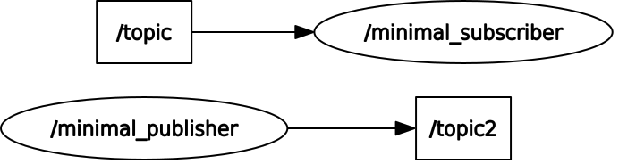

<!--

author:   Sebastian Zug & André Dietrich & Gero Licht
email:    sebastian.zug@informatik.tu-freiberg.de & andre.dietrich@informatik.tu-freiberg.de & gero.licht@informatik.tu-freiberg.de
version:  1.0.1
language: de
narrator: Deutsch Female

comment:  Praktische Einführung in ROS Tools und Konzepte

-->

[](https://liascript.github.io/course/?https://raw.githubusercontent.com/TUBAF-IfI-LiaScript/VL_Robotik/main/00_Intro/00_Praktikum.md)

## Einführungsbeispiele

**Arbeit auf der Konsole**

Die Exploration und Untersuchung eines ROS2 Systems erfolgt mittels des Tools "ros2". Mit diesem können die folgenden Konzepte adressiert werden. Dazu bietet das Tool folgende API:

```
>ros2
usage: ros2 [-h] Call `ros2 <command> -h` for more detailed usage. ...

options:
  -h, --help            show this help message and exit
  --use-python-default-buffering
                        Do not force line buffering in stdout and instead use
                        the python default buffering, which might be affected
                        by PYTHONUNBUFFERED/-u and depends on whatever stdout
                        is interactive or not

Commands:
  action     Various action related sub-commands
  bag        Various rosbag related sub-commands
  component  Various component related sub-commands
  daemon     Various daemon related sub-commands
  doctor     Check ROS setup and other potential issues
  interface  Show information about ROS interfaces
  launch     Run a launch file
  lifecycle  Various lifecycle related sub-commands
  multicast  Various multicast related sub-commands
  node       Various node related sub-commands
  param      Various param related sub-commands
  pkg        Various package related sub-commands
  run        Run a package specific executable
  security   Various security related sub-commands
  service    Various service related sub-commands
  topic      Various topic related sub-commands
  wtf        Use `wtf` as alias to `doctor`

  Call `ros2 <command> -h` for more detailed usage.
```


### Hello-World Implementierung

Wir versuchen das "Hello World"-Beispiel der ROS Community nachzuvollziehen, dass
zwei einfache Knoten - "minimal publisher" und "minimal subscriber" - definiert.

<!--
style="width: 90%; max-width: 860px; display: block; margin-left: auto; margin-right: auto;"
-->
```ascii

Publisher "topic"                                   Subscriber "topic"

+-------------------+       .---------------.       +--------------------+
| minimal_publisher | ----> | Message       | ----> | minimal_subscriber |
+-------------------+       |  string  data |       +--------------------+
                            .---------------.
```

Eine entsprechende Kommentierung eines ähnlichen Codes findet sich auf der ROS2 [Webseite](https://index.ros.org/doc/ros2/Tutorials/Writing-A-Simple-Cpp-Publisher-And-Subscriber/).

```python    Publisher.py
import rclpy
from rclpy.node import Node

from std_msgs.msg import String


class MinimalPublisher(Node):

    def __init__(self):
        super().__init__('minimal_publisher')
        self.publisher_ = self.create_publisher(String, 'topic', 10)
        timer_period = 0.5  # seconds
        self.timer = self.create_timer(timer_period, self.timer_callback)
        self.i = 0

    def timer_callback(self):
        msg = String()
        msg.data = 'Hello World: %d' % self.i
        self.publisher_.publish(msg)
        self.get_logger().info('Publishing: "%s"' % msg.data)
        self.i += 1


def main(args=None):
    rclpy.init(args=args)
    minimal_publisher = MinimalPublisher()
    rclpy.spin(minimal_publisher)
    rclpy.shutdown()

if __name__ == '__main__':
    main()
```


```python    Subscriber.py
import rclpy
from rclpy.node import Node

from std_msgs.msg import String


class MinimalSubscriber(Node):

    def __init__(self):
        super().__init__('minimal_subscriber')
        self.subscription = self.create_subscription(
            String,
            'topic',
            self.listener_callback,
            10)
        self.subscription  # prevent unused variable warning

    def listener_callback(self, msg):
        self.get_logger().info('I heard: "%s"' % msg.data)


def main(args=None):
    rclpy.init(args=args)
    minimal_subscriber = MinimalSubscriber()

    rclpy.spin(minimal_subscriber)
    minimal_subscriber.destroy_node()
    rclpy.shutdown()


if __name__ == '__main__':
    main()
```

Ok, wie lassen sich diese beiden Knoten nun starten. In dieser Veranstaltung
wollen wir uns allein auf die vorinstallierten Beispiele, in diesem Fall die Pakete `examples_rclpy_minimal_subscriber` und `examples_rclpy_minimal_publisher` konzentrieren. Dazu
starten wir diese jeweils mit

```
#ros2 run <package_name> <node>
ros2 run examples_rclpy_minimal_subscriber subscriber_member_function
ros2 run examples_rclpy_minimal_publisher publisher_member_function
```

Lassen Sie uns diese Konfiguration systematisch untersuchen:

1. Welche Nachrichten werden in unserem bescheidenen ROS2 System ausgetauscht?

```
>ros2 topic list
/parameter_events
/rosout
/topic
>ros2 topic info /topic
Topic: /topic
Publisher count: 1
Subscriber count: 1
>ros2 topic hz /topic
average rate: 2.011
   min: 0.489s max: 0.500s std dev: 0.00474s window: 4
...
```

2. Wie lassen sich mehrere Instanzen ein und des selben Knoten integrieren?

Es soll nochmals darauf hingewiesen werden, `topic` ist ein willkürlich gewählter Name für unseren Kanal. Um beim Testen von verschiedenen Nodes eine schnelle Umbenennung zu ermöglichen können wir mittels Remapping die Topic und Nodenamen anpassen.

```
> ros2 run examples_rclpy_minimal_publisher publisher_member_function --ros-args --remap /topic:=/topic2
```

```
>ros2 topic info /topic
Topic: /topic
Publisher count: 1
Subscriber count: 2
```

<!-- width="80%" -->
*Screenshot des Tools `rgt_graph`*

Natürlich können Sie auch den Topic-Namen aus der Kommandozeile anpassen. Damit entsteht ein neuer Kanal, der keine Subcriber hat.

```
> ros2 run examples_rclcpp_minimal_publisher publisher_member_function --ros-args --remap /topic:=/topic2
```

<!-- width="60%" -->
*Screenshot des Tools `rgt_graph`*

4. Wie kann ich die Nachrichten, die über den Kanal `topic` ausgetauscht werden, einsehen?

Zunächst klären wir, um welchen Typ es sich handelt.

```
>ros2 topic list -t    
/parameter_events [rcl_interfaces/msg/ParameterEvent]
/rosout [rcl_interfaces/msg/Log]
/topic [std_msgs/msg/String]
```
Nun können wir die Nachrichten einsehen.

```
>ros2 interface show std_msgs/msg/String
# This was originally provided as an example message.
# It is deprecated as of Foxy
# It is recommended to create your own semantically meaningful message.
# However if you would like to continue using this please use the equivalent in example_msgs.

string data
```

5. Kann ich auch einen Publisher in der Konsole erzeugen?

Natürlich, dies ist ein wichtiges Element des Debugging. Starten Sie also zum Beispiel den Subscriber mit den bereits bekannten Kommandos und führen Sie dann in einer anderen Konsole den nachfolgenden Befehl aus.

```
ros2 topic pub /topic std_msgs/String  "data: Glück Auf" -n TUBAF
```

Informieren Sie sich zudem über die weiteren Parameter von `ros2 topic pub`. Sie können die Taktrate und die Qualitätskritieren der Übertragung definieren.

### Turtlebot

Das "turtlebot" Beispiel soll die verschiedenen Mechanismen der Kommunikation unter ROS verdeutlichen. Dabei wird unter anderem eine Publish-Subscribe Kommunikation zwischen einem Node für die Nutzereingaben und einer grafischen Ausgabe realisiert.

```
ros2 run turtlesim turtle_teleop_key
ros2 run turtlesim turtlesim_node
```

<!-- width="90%" -->


Wir wollen wiederum das System inspizieren und nutzen dafür ein grafisches Inspektionssystem, das in ROS2 integriert ist. Hier werden die Methoden, die `ros2` auf der Kommandozeile bereithält in einer GUI abgebildet.

```
rqt
```

<!-- width="90%" -->


## Weiterführende Beispiele

Nunmehr wollen wir eine Kamera mit ins Spiel bringen. Eine Möglichkeit, um auf die im Betriebssystem enthaltenen Kameratreiber zuzugreifen ist die Nutzung des `v4l2` Treibers. Sie finden die zugehörige Paketinformation unter [v4l2_camera](https://index.ros.org/r/v4l2_camera/).

```bash
ros2 run v4l2_camera v4l2_camera_node
```

Wir können die Bilddaten entweder als reinen Bildstream betrachten (Datentyp spezifische Darstellung) oder "das große Besteck auspacken" und "rviz" nutzen

```
ros2 run rqt_image_view rqt_image_view
```

Nun wollen wir auch etwas sinnvolles damit anstellen. Lassen Sie uns eine einfache Gesichtserkennung implementieren. Wir nutzen dafür eine Beispielimplementierung aus dem Internet, die unter 

https://community.element14.com/technologies/robotics/b/blog/posts/ros2_2d00_learning_2d00_series_2d00_blog7

zu finden ist. Das Beispiel wollen wir aber gemeinsam umarbeiten ...

> Welche Einschränkungen sehen Sie in der Implementierung? Wie könnte die Qualität des Codes verbessert werden?