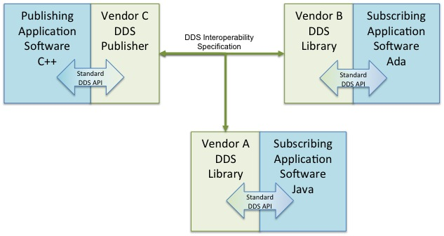

<!--

author:   Sebastian Zug & André Dietrich & Gero Licht
email:    sebastian.zug@informatik.tu-freiberg.de & andre.dietrich@informatik.tu-freiberg.de & gero.licht@informatik.tu-freiberg.de
version:  1.0.1
language: de
narrator: Deutsch Female

comment:  Motivation, Begriffsdefinitionen und Einordnung der Veranstaltung

import:   https://raw.githubusercontent.com/TUBAF-IfI-LiaScript/VL_Robotik/main/config.md

-->

[](https://liascript.github.io/course/?https://raw.githubusercontent.com/TUBAF-IfI-LiaScript/VL_Robotik/main/00_Intro/00_Vorlesung.md)


# Einführung

<!-- data-type="none" -->
| Parameter                 | Kursinformationen                                                                                                                                                              |
| ------------------------- | ------------------------------------------------------------------------------------------------------------------------------------------------------------------------------ |
| **Veranstaltung:**        | @config.lecture                                                                                                                                                                |
| **Semester**              | @config.semester                                                                                                                                                               |
| **Hochschule:**           | `Nordakademie - Hochschule der Wirtschaft`                                                                                                                                     |
| **Inhalte:**              | `Herausforderungen bei der Umsetzung von autonomen Robotern, Abgrenzung, Einordnung von ROS, Basiskonzepte`                                                         |
| **Link auf Repository: ** | [https://github.com/TUBAF-IfI-LiaScript/VL_Robotik/blob/main/00_Termin/00_Vorlesung.md](https://github.com/TUBAF-IfI-LiaScript/VL_Robotik/blob/main/00_Termin/00_Vorlesung.md) |
| **Autoren**               | @author                                                                                                                                                                        |


---------------------------------------------------------------------

**Fragen an die heutige Veranstaltung ...**

* 

---------------------------------------------------------------------


## Einordnung und Abgrenzung 

> A robot is a machine—especially one programmable by a computer—capable of carrying out a complex series of actions automatically. (Definition of `robot`. Oxford English Dictionary)

 von 1921")

### Unterscheidung 

**Welche Robotersysteme kommen in Ihren Unternehmen vor?**

<!-- data-type="none" -->
| **Kriterium**                | **Optionen**                                                  |
| ---------------------------- | ------------------------------------------------------------- |
| **Art der Steuerung**        | <span style="color:blue">autonom</span>, teleoperiert, hybrid |
| **Bewegungsfähigkeit**       | stationär, <span style="color:blue">mobil</span>              |
| **Anwendungsbereich**        | Industrie, Verkehr, Medizin ...                               |
| **Erscheinung**              | Humanoid, Nicht-humanoid                                      |
| **Energieversorgung**        | Autark, Batterien, Kabelgebunden                              |
| **Interaktionsfähigkeit**    | Kooperativ, Isoliert                                          |
| **Komplexität der Umgebung** | Niedrig, Hoch                                                 |
| **Sensorik und Wahrnehmung** | Einfach, <span style="color:red">Komplex</span>               |
| **Größe**                    | Mikroroboter, Makroroboter                                    |
| ...                          | ...                                                           |


### Bedeutung 

??[IFrame](https://books.google.com/ngrams/graph?content=Autonomous+Vehicle%2CAutonomous+Robot&year_start=1900&year_end=2022&corpus=en&smoothing=3 "Ngram Analyse der Begriffe Autonomous Vehicle und Autonomous Robot")

??[IFrame](https://books.google.com/ngrams/graph?content=artificial+intelligence%2Crobot%2CMachine+Learning%2C+deep+learning&year_start=1900&year_end=2022&corpus=en&smoothing=3 "Ngram Analyse der Begriffe Artificial Intelligence, Robot, Machine Learning und Deep Learning")

## Herausforderungen bei der Umsetzung 

Welche technologischen Herausforderungen gilt es bei der Umsetzung von mobilen Robotersystemen zu meistern?

+ **Technologische Herausforderungen**

   - Robuste, hinreichend präzise Positionierung
   - Umgebungskartierung (SLAM)
   - Hindernisidentifikation und - umgehung
   - Echtzeit-Umsetzung von Teilverhalten
   - Energieeffizienz
   - veränderliche Kommunikationsbedingungen
   - ...

+ **Wirtschaftliche Herausforderungen**

   - Wirtschaftlichkeit
   - Marktreife
   - ...

+ **Soziale und rechtliche Herausforderungen**

    - Sicherheitsanforderungen
    - Regulatorische Rahmenbedingungen
    - Ethik und Datenschutz
    - Arbeitsplatzverdrängung
    - ...

> Welche dieser Probleme sehen Sie als relevant bei den zwei Szenarien Lieferroboter und Aquatischer Roboter? 


## Ebenen eines Robotersystems / Teilkomponenten 

                   {{0-1}}
*************************************************

```ascii
                    Statusmeldungen 
     Nutzereingaben  ^                                       
                 |   |
Befehle          v   |
            +-----------------------+
            | Handlungsplanung      |  "$Strategie   $"
            +-----------------------+
                 |   ^     | | |        Folge von Aktionen     
                 v   |     v v v
            +-----------------------+
            | Ausführung            |  "$Taktik$    "           
            +-----------------------+
                     ^      | | |       Geplante Trajektorie,
Status               |      v v v       Verhalten
            +-----------------------+
            | Reaktive Überwachung  |  "$Ausführung$        "
            +-----------------------+
Sensordaten-    ^ ^ ^        | | |      Steuerbefehle an den 
erfassung       | | |        v v v      Aktuator 
            +----------+ +----------+
            | Sensoren | | Aktoren  |                               
            +----------+ +----------+
                  ^           |
                  |           v      
            .-----------------------.
            | Umgebung              |
            .-----------------------.                                                                                .
```


*************************************************

                   {{1-2}}
*************************************************

```ascii
                    Statusmeldungen 
     Nutzereingaben  ^                                                           
                 |   |                                                   Kommunikation, Nutzerschnittstellen
Befehle          v   |                                                                     
            +-----------------------+                                                                 
            | Handlungsplanung      |  "$Strategie   $"                  Verhaltensmodell                        
            +-----------------------+                                                                 
                 |   ^     | | |        Folge von Aktionen                                                      
                 v   |     v v v                                                                 
            +-----------------------+                                                                 
            | Ausführung            |  "$Taktik$    "                    Weltmodell, Handungsmuster Kontexterkennung
            +-----------------------+                                                                 
                     ^      | | |       Geplante Trajektorie,                                                        
Status               |      v v v       Verhalten                                                                 
            +-----------------------+                                                                 
            | Reaktive Überwachung  |  "$Ausführung$        "            Regelung, Energiemanagement                  
            +-----------------------+                                    Notaus-Erkennung                             
Sensordaten-    ^ ^ ^        | | |      Steuerbefehle an den                                             
erfassung       | | |        v v v      Aktuator                                                                  
            +----------+ +----------+                                                                 
            | Sensoren | | Aktoren  |                                    Hardwaretreiber                          
            +----------+ +----------+                                                                 
                  |           |                                                                 
                  v           v                                                                       
            .-----------------------.                                                                 
            | Umgebung              |                                                                 
            .-----------------------.                                                                                .
```


> Wer soll das denn alles implementieren?

*************************************************


                                  {{2-3}}
********************************************************************************

<!-- width="80%" -->
Comic auf der Webseite der Firma Willow Garage, das die individuellen Frameworks
für die Robotikentwicklung adressiert. [^2]

[^2]: Willow Garage, http://www.willowgarage.com/blog/2010/04/27/reinventing-wheel, 2010

********************************************************************************


### Vergleich von Frameworks

                                  {{0-1}}
********************************************************************************

1. Hardwareunterstützung und Laufzeitumgebung

+ **Betriebssystem** Eine Robotikentwicklungsumgebung sollte mehrere Betriebssysteme und dabei eine möglichst umfangreiche Abdeckung für häufig genutzte Bibliotheken, Komponenten oder Hardwaretreiber bieten.

+ **Unterstützung ressourcenbeschränkter Systeme** Die Interaktion und Kooperation mit ressourcenbeschränkten Systemen ist u.a. in Bereichen gefragt, in denen z.B. die Effizienz und Kosten der eingesetzten Komponenten eine tragende Rolle spielen. Für ein breites Anwendungsspektrum des jeweiligen Frameworks ist eine entsprechende Unterstützung solcher Systeme wünschenswert.

+ **Echtzeitfähigkeit** Robotikanwendungen umfassen häufig Anwendungselemente, die harte Echtzeitanforderungen an die Verarbeitung stellen. Regelschleifen zur Ansteuerung von Manipulatoren benötigen, um stabil zu laufen, ein deterministisches Zeitverhalten.

+ **Treiberintegration** Ein Framework sollte nicht nur eine die Vielfalt an Sensoren und Aktoren, sondern auch konkrete Robotersysteme spezifischer Hersteller, die auf diesen Komponenten aufsetzen, unterstützen.

********************************************************************************

                                  {{1-2}}
********************************************************************************

2. Kommunikation

+ **Kommunikationsmiddleware** Damit Anwendungen verteilt über mehrere Rechnerknoten laufen können und somit eine Ortsunabhängigkeit gewährleisten, sind entsprechende Mechanismen erforderlich.

+ **Kommunikationsparadigmen** Im Kontext einer Anwendung ist die Abdeckung unterschiedlicher Formen für den Nachrichtenaustausch zwischen den Komponenten wünschenswert. Als Interaktionsmuster sind die *Client-Server-Beziehung* und das *Publish-Subscribe-Modell* denkbar.

+ **Echtzeitfähigkeit** Anknüpfend an die Echtzeitfähigkeit der Laufzeitumgebung ist das deterministische Verhalten der Kommunikationsverbindungen Voraussetzung für die Entwicklung zeitkritischer Systeme.

********************************************************************************

                                  {{2-3}}
********************************************************************************

3. Programmierung

+ **Unterstützte Programmiersprachen**  Bei der Anwendungsentwicklung sollte dem Entwickler möglichst die Wahl gelassen werden, in welcher Programmiersprache entwickelt wird. Eine domain-spezifische Frage zielt dabei auf die Möglichkeit der grafischen Programmierung.

+ **Unterstützungsbibliotheken** Vordefinierte Komponenten z.B. für Pfadplanung, Verhaltensauswahl und Lokalisierung erleichtern den Entwicklungsprozess und fördern die Wiederverwendung von Software-Modulen, wobei gegebenenfalls entsprechende Anpassungen erforderlich sind.

+ **Erweiterbarkeit** Erweiterbarkeit bedeutet hier die Unterstützung für das Hinzufügen neuer Software-Module und neuer Hardware-Komponenten in das bestehende Rahmenwerk.

+ **Lizenzmodell** Der Typ der Lizenz der Frameworks bestimmt insbesondere im Fall der kommerziellen Nutzung über deren generelle Anwendbarkeit. Durch das gewählte Lizenzmodell wird die Breite der Entwicklungs-Community zumindest mitbestimmt. Eine aktive Community erleichtert die Entwicklungsarbeit und bieten in Wikis oder Foren eine Vielzahl von Antworten, Anregungen und Beispielcode.

********************************************************************************

                                  {{3-4}}
********************************************************************************

4. Test und Debugging

+ **Monitoring** Die Überwachung der einzelnen Komponenten und deren Beziehungen zueinander muss in einem übergreifenden Ansatz möglich sein, um komfortabel Aussagen über den Status des Robotersystemes. Eine grafische Schnittstelle, die die Visualisierung einzelner Komponenten, des Gesamtsystems oder einzelner Parameter übernimmt, vereinfacht die Entwicklung erheblich.

+ **Logging** Das Logging der Anwendungsoperation unterstützt einerseits das Debugging und ermöglicht andererseits eine Wiederholung dieser Anwendungsausführung im Sinne eines Wiederabspielens einer Aufzeichnung. Somit wird eine Offline-Analyse der implementierten Funktionalitäten möglich, sodass auch Aussagen über die Performance dieser bzw. des Gesamtsystems getroffen werden können.

+ **Simulation** Die Simulation der realen Welt ermöglicht es den Entwicklern, ihre Anwendungen zu testen, ohne die entsprechende Hardware besitzen zu müssen, indem diese geeignet modelliert wird. Die Simulatoren können dabei in Form von „einfachen“ zweidimensionalen bis hin zu komplexen 3-D-Umsetzungen mit realistischen physikalischen Gegebenheiten vorliegen.


********************************************************************************

## ROS, was ist das?

Robot Operating System (ROS) ist ein Framework für die Entwicklung von Robotern. Dabei ist ROS kein Betriebssystem sondern eine Middleware mit aufgesetzter Paketstruktur. 2020 listeten die Statistiken mehrere tausend Repositories und Pakete. ROS wird unter der BSD-Lizenz veröffentlicht und ist somit der Open-Source-Szene zuzuordnen.

Die Entwicklung begann 2007 am Stanford Artificial Intelligence Laboratory im Rahmen des Stanford-AI-Robot-Projektes (STAIR) und wurde ab 2009 hauptsächlich am Robotikinstitut Willow Garage weiterentwickelt. Seit April 2012 wird ROS von der neu gegründeten, gemeinnützigen Organisation Open Source Robotics Foundation (OSRF) unterstützt und seit Beendigung der operativen Tätigkeit von Willow Garage 2013 von dieser koordiniert, gepflegt und weiterentwickelt.

Die Hauptbestandteile und -aufgaben von ROS sind:

+ Hardwareabstraktion
+ Gerätetreiber
+ oft wiederverwendete Funktionalität
+ Nachrichtenaustausch zwischen Programmen bzw. Programmteilen
+ Paketverwaltung
+ Programmbibliotheken zum Verwalten und Betreiben der Software auf mehreren Computern

Die Webseite von ROS findet sich unter [ROS](https://www.ros.org/).

Seit 2013 beschäftigt sich das ROS Industrial Consortium mit der Förderung und Unterstützung von ROS für Anwendungen in der Industrierobotik. In Europa koordiniert das Fraunhofer IPA (Stuttgart) die Aktivitäten des ROS Industrial Consortium Europe.

Seit Beginn der Entwicklung von ROS 2.0 wird zwischen ROS 1 und ROS 2 unterschieden. Die beiden Hauptversionen sind nicht miteinander kompatibel, jedoch interoperabel und können parallel ausgeführt werden.

Die aktuellen Versionen sind

+ ROS1 - _Noetic Ninjemys_ (Noetische Ninjemys Oweni) veröffentlicht im Mai 2020 und
+ ROS2 - _Humble Hawksbill_ (bescheidene Echte Karettschildkröte) Veröffentlichung im Mai 2021 (LTS Version).
+ ROS2 - _Iron Irwini_ (eiserne Irwins Schildkröte) Veröffentlichung im Mai 2023.

>  In der Fachwelt für das autonome Fahren werden auch gerne zumindest Teile von ROS eingesetzt. In der Robotik nutzen mittlerweile nahezu alle Forschungsgruppen zumindest teilweise ROS. Viele Forschungsgruppen besitzen gar kein eigenes Softwareframework mehr, sondern konzentrieren sich voll auf ROS. *golem.de [Beitrag - Für wen ist ROS?](https://www.golem.de/news/robot-operating-system-was-bratwurst-bot-und-autonome-autos-gemeinsam-haben-1612-124079-4.html)*

Das erste Paper, in dem die Basiskonzepte beschrieben wurden, ist unter [Link](http://www.robotics.stanford.edu/~ang/papers/icraoss09-ROS.pdf) zu finden.

###  ROS 1 vs. ROS 2

<!-- data-type="none" -->
| Merkmal                     | ROS1                                                                                     | ROS2                                                                                                                                                                             |
|:----------------------------|:-----------------------------------------------------------------------------------------|:---------------------------------------------------------------------------------------------------------------------------------------------------------------------------------|
| Betriebssysteme             | Linux (Ubuntu, Gentoo, Debian), OS X                                                     | Linux  (Ubuntu), OS X, Windows 10                                                                                                                                                |
| Programmiersprachen C       | C++03                                                                                    | C++11 (einzelne Konzepte von C++14)                                                                                                                                              |
| Programmiersprachen Python  | Python 2                                                                                 | Python 3.5                                                                                                                                                                       |
| Middleware                  | eigene Konzepte für den Datenaustausch                                                   | abstraktes Middlewarekonzept offen für spezifische Lösungen (aktuell DDS als Default-Implementierung), mit einem geeigneten Middleware-Ansatz sind Echtzeitanwendungen umsetzbar |
| Build System                | [CMake](https://cmake.org/) Projekte mit [catkin](https://docs.ros.org/api/catkin/html/) | CMake Projekte (mit colcon), andere Systeme können integriert werden                                                                                                             |
| Paketstruktur               | Integrierende Pakete möglich                                                             | aus Gründen der automatisierten Auflösung von Abhängigkeiten nur isolierte Pakete                                                                                                |
| Message/Service Deklaration | Messageformatdefinitionen auf der Basis von Grundtypen,                                  | einheitliche Namen in Python und C++, default Werte, separate Namespaces für Services und Messages, einheitliche Zeittypen für die APIs                                          |
| Systemkonfiguration         | XML Beschreibungen                                                                       | Python Code für den Systemstart mit komplexen Logiken                                                                                                                            |
| Node vs. Nodelet            | unterschiedliche APIs für beide Konzepte                                                 | Implementierungen zielen auf eine Shared Library - es wird zur Laufzeit entschieden, ob diese als separater Prozess oder innerhalb eines Prozesses ausgeführt wird.              |

Einen Überblick zu den genannten Features gibt die Webseite [Link](http://design.ros2.org/articles/changes.html)

                                           {{1-2}}
*******************************************************************************
**Ersetzt ROS2 als ROS1 vollständig?**

Blick zurück ...

> *The quick answer is: Yes but with drawbacks. So ROS2 Crystal has worked with the new Gazebo with ROS2 support, so you have access to creating your own simulations using only ROS2. You have access to the main ROS packages like tf, navigation, image_transport, rqt, and the big RVIZ. So it would seem that 90% of the current ROS users would be satisfied. ...*

> *But the reality is that a huge amount of packages don’t come out of the box working for ROS2 or are installed through debians.* [^Ref]

[^Ref]: The Construct, "ROS2 vs ROS1? Or more like ROS2 + ROS1?" https://www.theconstructsim.com/ros2-vs-ros1/, 2018

> Aktuell sollten neue Projekte immer auf ROS2 aufsetzen!

Falls es Probleme bei der Umsetzung einzelner Pakete gibt, bietet das Paket `ros1_bridge` Hilfe, das die Kommunikation zwischen einem ROS1 und einen ROS2 Graphen
sicherstellt.

*******************************************************************************

### Wie kann man sich in ROS einarbeiten?

                                 {{0-4}}
*******************************************************************************

1. Das offizielle ROS-Tutorial-Website ist sehr umfangreich und in mehreren Sprachen verfügbar. Es enthält Details zur ROS-Installation, Dokumentation von ROS, etc. und ist völlig kostenlos.  Dabei lauern aber einige Fallstricke:

   * Achten Sie immer, wenn Sie sich in ein Beispiel einlesen auf die zugehörige ROS-Versionsnummer!
   * Prüfen Sie Abhängigkeiten und die Aktualität der Bibliotheken.
   * Informieren Sie sich darüber in wie weit an dem Paket aktuell noch gearbeitet wird. Letzte Commits vor einigen Monaten sind immer ein schlechtes Zeichen :-)

<!-- data-type="none" -->
| ROS2                                                | ROS1                               | Hintergrund                  |
|:----------------------------------------------------|:-----------------------------------|:-----------------------------|
| https://index.ros.org/doc/ros2/                     | http://wiki.ros.org/               | Hauptseite des Projektes OSF |
| https://discourse.ros.org/                          | https://answers.ros.org/questions/ | ROS Forum                    |
| https://index.ros.org/doc/ros2/Tutorials/#tutorials | http://wiki.ros.org/ROS/Tutorials  | ROS Tutorials                |

*******************************************************************************

                                 {{1-4}}
*******************************************************************************

2. Es existiert eine Vielzahl von Tutorials in Form von Videos, die einen Überblick versprechen oder einzelne Themen individuell adressieren.

<!-- data-type="none" -->
| Titel                    | Inhalt                                                              | Link                                                                                        |
|:-------------------------|:--------------------------------------------------------------------|:--------------------------------------------------------------------------------------------|
| ROS tutorial #1          | Installation, erste Schritte                                        | [Link](https://www.youtube.com/watch?v=9U6GDonGFHw&t=72s)                                   |
| Programming for Robotics | 5 Kurse als Einführung in ROS1 der ETH Zürich                       | [Link](https://www.youtube.com/watch?v=0BxVPCInS3M&list=PLE-BQwvVGf8HOvwXPgtDfWoxd4Cc6ghiP) |
| ROS2 Tutorials           | Tutorial des kommerziell orientierten Kursanbieters "The Construct" | [Link](https://www.youtube.com/playlist?list=PLK0b4e05LnzYNBzqXNm9vFD9YXWp6honJ)            |

*******************************************************************************

                                 {{2-4}}
*******************************************************************************

3. Verschiedene Hochschulen und Institutionen bieten Kurse und Summer Schools an - diese sind teilweise kostenpflichtig!

*******************************************************************************

                                 {{3-4}}
*******************************************************************************

4. Zu empfehlen ist das Buch von Newmann "A Systematic Approach to Learning Robot Programming with ROS" oder aber von Kane "A Gentle Introduction to ROS". Letzteres ist online unter [Link](https://cse.sc.edu/~jokane/agitr/agitr-letter.pdf) zu finden. Beide beziehen sich aber auf ROS 1.

*******************************************************************************

## Basiskonzepte

**Node** - Ein Knoten ist Teilnehmer im ROS-Graphen. ROS-Knoten verwenden eine ROS-Clientbibliothek, um mit anderen Knoten zu kommunizieren. Knoten können ein *Subject* veröffentlichen oder abonnieren. *Nodes* können auch einen Dienst bereitstellen oder verwenden. Einem Knoten sind konfigurierbare Parameter zugeordnet. Verbindungen zwischen Knoten werden durch einen verteilten Erkennungsprozess hergestellt. Knoten können sich im selben Prozess, in unterschiedlichen Prozessen oder auf unterschiedlichen Rechnern befinden.

**Messages** - To enable the communication of data packets between the nodes, their structure and content format must be specified. Which data formats are used, where is the sending sensor located, which units of measurement represent the information? ROS defines abstract message types for this purpose.

<!-- width="100%" -->
*Screenshot der Knoten eines umfangreicheren Projektes. Die Ellipsen repräsentieren die Knoten, die rechteckigen Boxen die "Datenkanäle" dazwischen.*

**Discovery** - Die Erkennung von *Nodes* erfolgt automatisch über die zugrunde liegende Middleware von ROS2. Dafür sind folgende Punkte zu beachten

+ Wenn ein Knoten gestartet wird, kündigt er seine Anwesenheit anderen Knoten im Netzwerk mit derselben ROS-Domäne an (festgelegt mit der Umgebungsvariablen `ROS_DOMAIN_ID`). Knoten antworten auf diese Ankündigung mit Informationen über sich selbst, so dass die entsprechenden Verbindungen hergestellt werden können und die Knoten kommunizieren können.

+  Knoten informieren regelmäßig über ihre Anwesenheit, damit Verbindungen zu neu erscheinenden Entitäten hergestellt werden können, die während des eigenen Starts noch nicht aktiv waren.

+ Knoten stellen nur dann Verbindungen zu anderen Knoten her, wenn diese über kompatible Quality of Service-Einstellungen verfügen.

**Topics** - Topics repräsentieren den Inhalt einer Nachricht und erlauben damit die Entkopplung von Informationsquelle und Informationssenke. Die Knoten brauchen nicht zu wissen, mit wem sie kommunizieren, allein das "Label" oder "Thema" genügt.

**Messages** - Um die Kommunikation von Datenpaketen zwischen den Knoten zu ermöglichen, muss deren Aufbau und inhaltliches Format spezifiziert werden. Welche Datenformate werden verwendet, wo befindet sich der versendende Sensor, welche Maßeinheiten bilden die Informationen ab? ROS definiert dafür abstrakte Message-Typen.

<!--
style="width: 80%; max-width: 860px; display: block; margin-left: auto; margin-right: auto;"
-->
```ascii

Publisher "dist"                             Subscriber "dist"

+------------+       .---------------.       +------------+
| Node 1     | ----> | Message       | ----> | Node 2     |
+------------+       |  Float32 data |       +------------+
                     |  Int     type |
                     .---------------.
 Distance sensor                             Speed control
```

Die ROS2 Message-Spezifikation integriert verschiedene Konfigurationsmöglichkeiten. Auf der obersten Ebene sind dies einfache Namens- und Typzuweisungen. Dabei wird zwischen sogenannten Built-in Typen und nutzerspezifischen Typen unterschieden. Feldnamen müssen klein geschriebene alphanumerische Zeichen mit Unterstrichen zur Trennung von Wörtern sein. Die Typdefinitionen der Basistypen erfolgen anhand "C++ naher" Bezeichner (`bool`, `char`, `float32` usw. )

Komplexe Typen werden wie folgt spezifiziert

<!-- data-type="none" -->
| Index | ROS2 msg Type           | C++                |
|:------|:------------------------|:-------------------|
| 0     | zB. `float32`           | `float`            |
| 1     | `string`                | `std::string`      |
| 2     | static array            | `std::array<T, N>` |
| 3     | unbounded dynamic array | `std::vector<T>`   |
| 4     | bounded dynamic array   | custom_class<T,N>  |
| 5     | bounded string          | `std::string`      |


Im folgenden sollen Beispiele die

```
# Basic format: fieldtype1 fieldname1
# Type 0, 1 examples:
int32 my_int
string my_string

# Type 2
int32[5] five_integers_array
# Type 3
int32[] unbounded_integer_array
# Type 4
int32[<=5] up_to_five_integers_array

# Type 5
string<=10 up_to_ten_characters_string
string[<=5] up_to_five_unbounded_strings
string<=10[] unbounded_array_of_string_up_to_ten_characters each
string<=10[<=5] up_to_five_strings_up_to_ten_characters_each
```

Eine weitere Neuerung besteht in der Möglichkeit Default-Werte und Konstanten zu definieren.

```
# Field default values
uint8 x 42
int16 y -2000
string full_name "John Doe"
int32[] samples [-200, -100, 0, 100, 200]

# Constant values with "="
int32 X=123
string FOO="foo"
```

Eigene Messagetypen umfassen üblicherweise eine Hierarchie von Messages und Sub-Messages. Untersuchen Sie zum Beispiel das Standard-Laserscanner Nachrichtenformat:

```
> ros2 msg show sensor_msgs/msg/LaserScan
```

Knoten, die einen Wert publizieren lassen sich neben den Programmen auch auf der
Kommandozeile erzeugen. Damit besteht für Tests eigener Subscriber die Möglichkeit diese sehr einfach mit spezifischen Nachrichten zu triggern.

```
ros2 topic pub /test s
```

**Pakete** - Pakete kapseln einzelne Algorithmen und realisieren deren Abhängigkeiten. Letztendlich wird damit die Wiederverwendbarkeit einer Implementierung gewährleistet.

https://fkromer.github.io/awesome-ros2/


**Worin unterscheiden sich ROS1 und ROS2 in Bezug auf diese Konzepte?**

Einen Überblick bietet die Webseite unter folgendem [Link](http://design.ros2.org/articles/interface_definition.html)

<!-- data-type="none" -->
| Parameter           | ROS2 node                                                                                      | ROS1 node                                                                                      |
|:--------------------|:-----------------------------------------------------------------------------------------------|:-----------------------------------------------------------------------------------------------|
| Zweck               | Ausführbares Programm im ROS1 Kontext, das in der Lage ist mit anderen Knoten zu kommunizieren | Ausführbares Programm im ROS2 Kontext, das in der Lage ist mit anderen Knoten zu kommunizieren |
| Discovery           | Verteilte Discovery-Mechanismen (die nicht von einem einzelnen Knoten abhängen)                | ROS Master als zentrale Verwaltungsinstanz der Kommunikation                                   |
| Client Bibliotheken | `rclcpp` = C++ client Library, `rclpy` = Python client library C++                             | `roscpp` = C++ client Library, `rospy` = Python client library                                 |

## Middleware?

                         {{0-1}}
********************************************************************************

> Middleware im Kontext verteilter Anwendungen ist eine Software, die über die vom Betriebssystem bereitgestellten Dienste hinaus Dienste bereitstellt, um den verschiedenen Komponenten eines verteilten Systems die Kommunikation und Verwaltung von Daten zu ermöglichen.

Middleware unterstützt und vereinfacht komplexe verteilte Anwendungen, sonst müsste die Anwendung Fragen wie:

+ Welche Informationen sind verfügbar?
+ In welchem Format liegen die Daten vor, bzw. wie muss ich meine Informationen verpacken?
+ Wer bietet die Informationen an?
+ Welche Laufzeit haben die Daten maximal?
...

Eine Middleware befreit die Applikation davon diese Frage zu beantworten. Vielmehr bieten Middleware-Dienste  einen Satz von Programmierschnittstellen, um einer Anwendung:

+ eine beliebige "Lokalisierung" im gesamten Netzwerk zu ermöglichen
+ eine standardisierte Interaktion mit einem anderen Dienst oder einer anderen Anwendung umzusetzen
+ Daten zu filtern (Inhalte, Autorisierung)
+ eine unabhängigen Netzzugriff unabhängig vom Netztyp sicherzustellen
+ einen zuverlässigen Datenaustausch sicherzustellen.

> __Merke:__ DDS ist ein Beispiel einer Middleware.

********************************************************************************

                         {{1-2}}
********************************************************************************

__Und in ROS2?__

Für die Realisierung dieser Aufgabe stehen unterschiedlichen Lösungsansätze mit
verschiedenen Schwerpunktsetzungen bereit. Entsprechend integriert ROS2 ein
abstraktes Interface für ein Einbettung von Middelware-Lösungen, die den DDS Standard implementieren.

DDS stellt einen "Globalen Daten Raum" zur Verfügung, der diese allen interessierten
verteilten Anwendungen zur Verfügung stellt.

<!-- style="width: 60%; min-width: 420px; max-width: 800px;"-->

+ Datenobjekte werden mit einer Domain-ID, einem Topic und einen Schlüssel adressiert.
+ Die Nachfrager (Subscriber) sind von den Produzenten (Publisher) entkoppelt.
+ Filter ermöglichen die inhaltliche Definition von relevanten Informationen auf Subscriberseite.
+ Die Verbindung wird über _Contracts_ spezifiziert, die die _Quality_ _of_ _Service_ (QoS) definiert
+ Die Verbindung zwischen Subscribern und Publishern wird automatisch hergestellt.

Der DDS Standard wurde durch verschiedene Unternehmen und Organisationen unter dem Dach der Object Management Group (OMG) vorangetrieben. Eine Beschreibung findet sich unter [Link](https://www.omg.org/spec/DDS/).

********************************************************************************

                         {{2-3}}
********************************************************************************

ROS2 hat als Default Lösung die Implementierung `rmw_fastrtps_cpp`, die von der Firma eProsima unter einer Apache 2.0 Lizenz verbreitet wird, integriert. Alternative Umsetzungen lassen sich anhand der unterstützten Hardware, des Overheads für den Nachrichtenaustausch bzw. anhand der Dauer für die Nachrichtenverbreitung abgrenzen. (vgl [A performance comparsion of OpenSplice and RTI implementations](https://www.researchgate.net/publication/271550363_Data_Distribution_Service_DDS_A_performance_comparison_of_OpenSplice_and_RTI_implementations)). Daher sieht ROS2 ein abstraktes Interface vor, dass ein Maximum an Austauschbarkeit gewährleisten soll.

vgl. https://index.ros.org/doc/ros2/Concepts/DDS-and-ROS-middleware-implementations/

<!--
style="width: 80%; min-width: 520px; max-width: 820px;"
-->
```ascii

              User Applications
+---------+---------+---------+
| rclcpp  | rclpy   | rcljava | ...
+---------+---------+---------+-----------------------------+
| rcl (C API) ROS client library interface                  |
| Services, Parameters, Time, Names ...                     |
+-----------------------------------------------------------+
| rmw (C API) ROS middleware interface                      |
| Pub/Sub, Services, Discovery, ...                         |
+-----------+-----------+-------------+-----+---------------+
| DDS       | DDS       | DDS         | ... | Intra-process |
| Adapter 0 | Adapter 1 | Adapter 2   |     |      API      |
+-----------+-----------+-------------+     +---------------+
| FastRTPS  | RTI       | PrismTech   | ...
|           | Context   | OpenSplice  |
+-----------+-----------+-------------+                                        .
```

********************************************************************************

                         {{3-4}}
********************************************************************************

Welche Aufgaben bildet DDS für ROS2 über entsprechende Schnittstellen ab?

__Discovery__ ... DDS ist vollständig verteilt, auch auf der Ebene des Discovery Systems und steht damit im Unterschied zu ROS1, dass ein zentrales Koordinationselemente `roscore` einsetzte. Damit entfällt der zentralen Fehlerpunkt, der für die Kommunikation zwischen Teilen des Systems erforderlich ist.

  1. Wenn ein Knoten gestartet wird, wirbt er für seine Anwesenheit bei anderen Knoten im Netzwerk mit derselben ROS-Domäne (gesetzt mit der Umgebungsvariablen `ROS_DOMAIN_ID`). Knoten reagieren auf diese Werbung mit Informationen über sich selbst, damit die entsprechenden Verbindungen hergestellt werden können und die Knoten kommunizieren können.

  2. Knoten bewerben ihre Präsenz regelmäßig, so dass auch nach der ersten Erkundungsphase Verbindungen zu neu gefundenen Einheiten hergestellt werden können.

  3. Knoten informieren die anderen Knoten, wenn sie offline gehen.

__Publish/Subscribe__ ... DDS implmentiert das Publish/Subscribe Paradigma in Kombination mit Quality of Service Attributen. Diese dienen der Koordination des Datenaustausches unter Berücksichtigung von zwingenden Anforderungen des Subscribers bzw. dem Verhalten des Publishers.

__Services and Actions__ ... DDS verfügt derzeit nicht über einen Request-Response-Mechanismus, mit dem die entsprechenden Konzept der Dienste in ROS umgesetzt werden könnten. Derzeit wird in der OMG DDS-Arbeitsgruppe eine RPC-Spezifikation zur Ratifizierung geprüft, und mehrere der DDS-Anbieter haben einen Entwurf für die Implementierung der RPC-API.

********************************************************************************