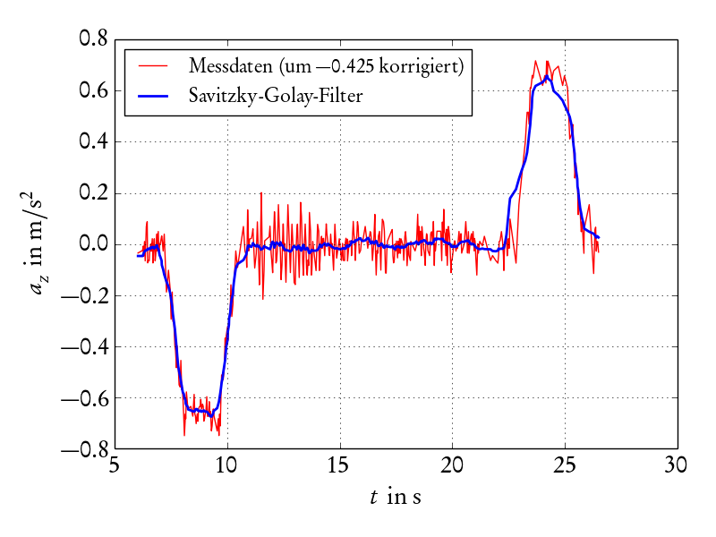
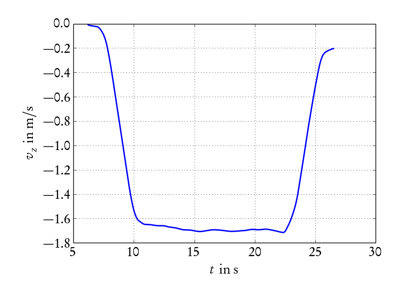
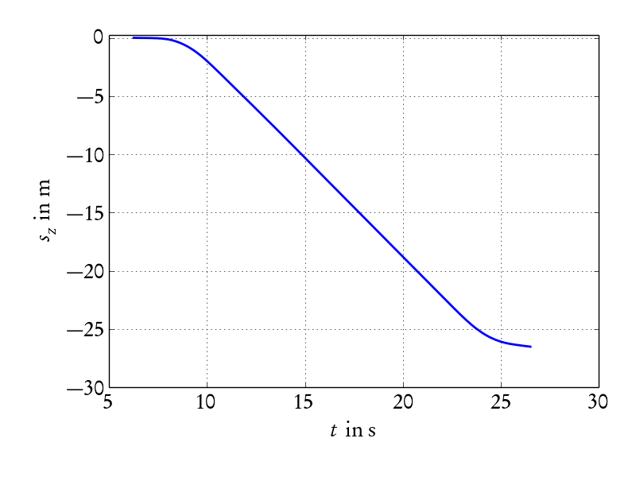
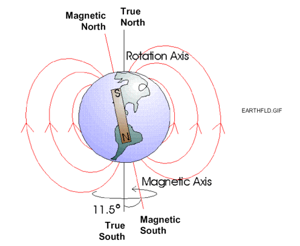
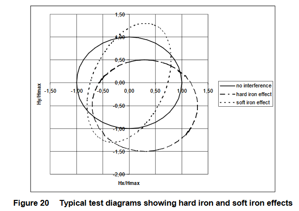
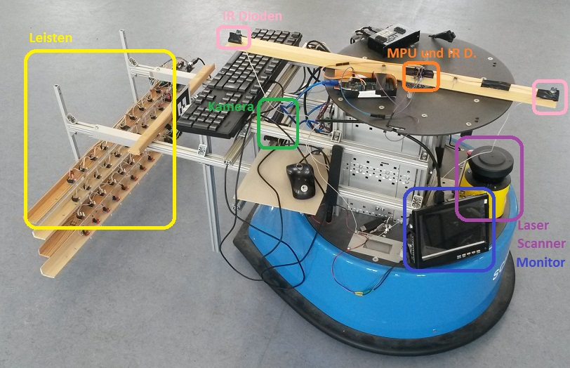
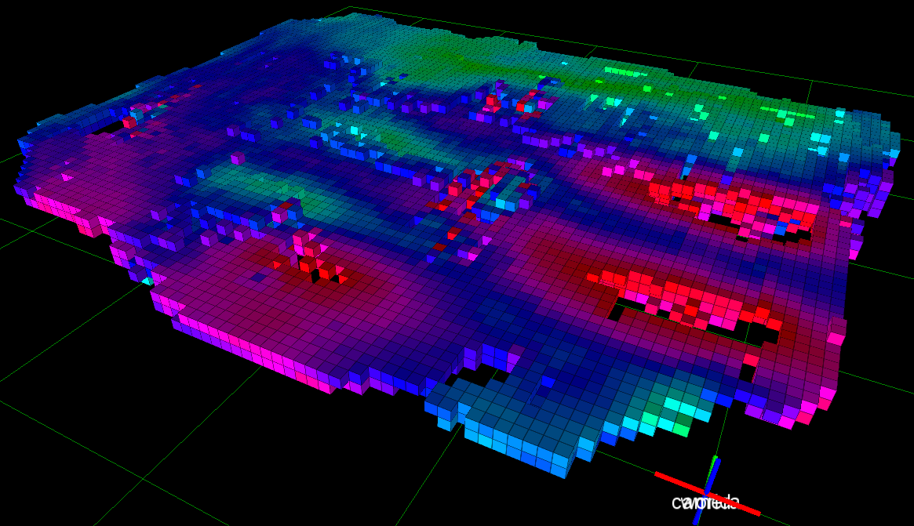

<!--

author:   Sebastian Zug & André Dietrich & Gero Licht
email:    sebastian.zug@informatik.tu-freiberg.de & andre.dietrich@informatik.tu-freiberg.de & gero.licht@informatik.tu-freiberg.de
version:  1.0.1
language: de
narrator: Deutsch Female

comment:  Sensoren im Kontext mobiler Roboter

import:   https://raw.githubusercontent.com/TUBAF-IfI-LiaScript/VL_Robotik/main/config.md

-->

[](https://liascript.github.io/course/?https://raw.githubusercontent.com/TUBAF-IfI-LiaScript/VL_Robotik/main/02_Sensors/00_Vorlesung.md)


# Einführung

<!-- data-type="none" -->
| Parameter                | Kursinformationen                                                                       |
| ------------------------ | --------------------------------------------------------------------------------------- |
| **Veranstaltung:**       | @config.lecture                                                                         |
| **Semester**             | @config.semester                                                                        |
| **Hochschule:**          | `Nordakademie - Hochschule der Wirtschaft`                                              |
| **Inhalte:**             | `Sensoren und Sensordatenverarbeitung im Kontext mobiler Roboter`                       |
| **Link auf Repository:** | [https://github.com/TUBAF-IfI-LiaScript/VL_Robotik/blob/main/02_Sensors/00_Vorlesung.md |
| **Autoren**              | @author                                                                                 |


---------------------------------------------------------------------

**Fragen an die heutige Veranstaltung ...**

* 

---------------------------------------------------------------------

## Einordnung

Wie weit sind wir bisher gekommen? Dank ROSn können wir beliebige Knoten in unterschiedlichen
Funktionen entwerfen und miteinander verknüpfen. Welche Elemente brauchen wir aber und wie verknüpfen wir diese?


<!--
style="width: 70%; max-width: 720px; display: block; margin-left: auto; margin-right: auto;"
-->
```ascii
                       +----------------------+
                       | Handlungsplanung     |   Strategie
                       +----------------------+
                                ^ ^ ^
                                | | |                  
                                v v v
                       +----------------------+
                       | Ausführung           |   Taktik
                       +----------------------+
                                ^ ^ ^
                                | | |
                                v v v
                       +----------------------+
                       | Reaktive Überwachung |   Ausführung
                       +----------------------+
 Sensordatenerfassung    ^ ^ ^          | | |    
 Aktuatoroperationen     | | |          v v v     
                       .-----------------------.
                       | Umgebung              |
                       .-----------------------.                               .
```

Im weiteren Verlauf der Veranstaltung werden wir uns auf den letzte Ebene fokussieren
und die elementare Verarbeitungskette verschiedener Sensorsysteme analysieren.

<!--
style="width: 70%; max-width: 7200px; display: block; margin-left: auto; margin-right: auto;"
-->
```ascii

       +----------+        +----------+                                
     +-+--------+ |     +--+--------+ |     +----------+     +----------+
+--> |Sensorik  +-+ --> | Filterung +-+ --> | Regelung | --> | Aktorik  | ---+
|    +----------+       +-----------+       +----------+     +----------+    |
|                                                                            |
|                              .---------------------.                       |
+----------------------------- | Umgebung            | <---------------------+
                               .---------------------.
```
Beginnen wir also mit der Sensorik ...

### Sensorik des Menschen

__Aufgabe:__ 	Gewinnung von Information über internen („Propriozeption“) 	bzw. externen Zustand  („Exterozeption“)  = „Wahrnehmung“ von 	Eigenzustand und Umwelt;

__Zielstellung:__ Möglichkeit zur Reaktion auf innere und äußere Einflüsse


| Klassifikation | Umsetzung                                  |
| -------------- | ------------------------------------------ |
| Modalitäten    | + Sehen, Hören, Riechen, Schmecken, Fühlen |
|                | + Temperatur, Gleichgewicht                |
|                | + Hunger, Durst                            |
| Qualitäten     | + rot, grün, blau                          |
|                | + süß, sauer, salzig, bitter               |
|                | + ungefähr 7 Grundgerüche                  |
| Intensität     | Amplitude                                  |

Und wie funktioniert das? Sogenannten Rezeptoren ...

... sind spezialisierte Zellen, die von bestimmten inneren oder äußeren Reizen angeregt werden und sie dann in Form von elektrischen Impulsen oder chemischen Reaktionen weiterleiten.

.. ein ausreichend starker Reiz bewirkt eine Veränderung des Membranpotentials (Generatorpotential)

... lösen ab einer gewissen Intensität des Reizes ein Schmerzempfinden aus.

| Rezeptoren        | Reiz                    |
| ----------------- | ----------------------- |
| Mechanorezeptoren | mechanische Deformation |
| Thermorezeptoren  | Temperaturänderung      |
| Photorezeptoren   | Licht                   |
| Chemorezeptoren   | Geschmäcker und Gerüche |

### Technische Sensoren


    {{0-1}}
*******************************************************************************

> Sensoren (lateinisch „fühlen“ ) transformieren physikalische, chemische oder biologische Messgrößen in elektrische Signale und stellen damit das unmittelbare Interface eines Messsystems zur Umgebung dar.

Achtung, die einschlägige deutsche Norm DIN 1319 1-4 vermeidet den Begriff und spricht stattdessen in Abschnitt 2 vom „Messaufnehmer“ als dem Beginn der Messkette. Entsprechend ist die Abgrenzung des eigentlichen Sensorbegriffes auch domainspezifisch und individuell unterschiedlich.

*******************************************************************************


    {{1-2}}
*******************************************************************************

")

*******************************************************************************

    {{2-3}}
*******************************************************************************
__Klassifikation von Sensoren__

+ intern/extern ... bezogen auf den Messgegenstand (Radencoder vs. Kamera)
+ aktiv/passiv () ... mit und ohne Beeinflussung der Umgebung (Ultraschall vs. Kamera)
+ Ergebnisdimension ... 1, 2, 2.5, 3D
+ Modalitäten ... physikalische Messgröße

<!--
style="width: 80%; max-width: 720; display: block; margin-left: auto; margin-right: auto;"
-->
```ascii

                Sensoren
                   |
      +------------+--------------+
      |                           |
 interne Sensoren         externe Sensoren
                                  |
               +------------------+----------+
               |                             |
            taktil                     berührungslos
                                             |
                          +------------+-----+-------+---------+
                          |            |             |         |
                      akustisch     optisch     bildbasiert   ....             .
```

*******************************************************************************

    {{3-4}}
*******************************************************************************
Parameter eines Sensors

| Parameter                     | Bedeutung                                                                                                                |
| ----------------------------- | ------------------------------------------------------------------------------------------------------------------------ |
| Messbereich                   | Ausdehnung erfassbaren physikalischen Messgröße (DIN 1319)                                                               |
| Auflösung                     | Vermögen physikalische Größen zu trennen und definiert über Granularitäten in Bezug auf Winkel, Entfernungen, Pixel usw. |
| Linearität                    | Abbildungsverhalten in Bezug auf den Zusammenhang zwischen Eingangsgröße und Ausgabewert. Im linearen Fall gilt $y=mx+n$ |
| Messfrequenz                  | Häufigkeit der Abtastung                                                                                                 |
| Querempfindlichkeit           | Abhängigkeit der Ausgabe von weiteren Parametern als der eigentlichen Messgröße                                          |
| Ausgabeprotokoll              | Ausgabeschnittstelle für die weitere Verarbeitung                                                                        |
| Öffnungswinkel                | Erfassungsbereich des Sensors bei gerichteter Datenerfassung                                                             |
| Energieaufnahme, Bauraum, ... |                                                                                                                          |

*******************************************************************************

## Sensoren des Turtlebots 

Das Turtlebot ist ein mobiles Robotersystem, das auf der Basis von ROS entwickelt wurde. Es besteht aus einem mobilen Roboter, der mit einer Vielzahl von Sensoren ausgestattet ist. Die Sensoren sind so konzipiert, dass sie die Umgebung des Roboters erfassen und ihm ermöglichen, sich in dieser Umgebung zu bewegen. Die Sensoren des Turtlebots umfassen:

+ IMU (Inertial Measurement Unit)
+ Odometrie
+ Laserscanner
+ Kamera

> Aufgabe 1: Recherchieren Sie die Position der IMU und der Odometrie auf dem Turtlebot! (5min)

### Inertialsensorik

Ein Trägheitsnavigationssystem ermöglicht die Messung der Bewegungen über insgesamt sechs kinematische Freiheitsgrade. Über die physikalischen Beziehungen (Trägheits- und Impulsgesetze) der Größen

+ Kraft,
+ Beschleunigung,
+ Winkelgeschwindigkeit (Drehrate),
+ Geschwindigkeit

werden Positionsaussagen bestimmt. Hauptvorteil ist die Unabhängig von jeglichen Ortungssignalen aus der Umgebung ist.

### Beschleunigungssensoren

__Funktionsprinzip__

| Prinzip                                  | Sensor                                                                                                                                                                                                                                                                                                                |
| ---------------------------------------- | --------------------------------------------------------------------------------------------------------------------------------------------------------------------------------------------------------------------------------------------------------------------------------------------------------------------- |
| Dehnungsmesstreifen                      | ... Bestimmung der Kraft auf die Testmasse, indem die Verformung der Befestigung (z. B. eines Stabes) mittels Dehnungsmessstreifen bestimmt wird.                                                                                                                                                                     |
| Piezoelektrische Beschleunigungssensoren | ... ein piezokeramisches Sensorplättchen wandelt Druckschwankungen in elektrische Signale um. Die Druckschwankung wird durch eine an der Piezokeramik befestigte (seismische) Masse erzeugt und wirkt bei einer Beschleunigung des Gesamtsystems auf die Piezokeramik.                                                |
| Mikro-elektro-mechanische Systeme (MEMS) | Feder-Masse-Systeme, bei denen die „Federn“ nur wenige μm breite Silicium-Stege sind und auch die Masse aus Silicium hergestellt ist. Durch die Auslenkung bei Beschleunigung kann zwischen dem gefedert aufgehängten Teil und einer festen Bezugselektrode eine Änderung der elektrischen Kapazität gemessen werden. |

Konzentrieren wir uns auf das letztgenannte Konzept.

<iframe width="560" height="315" src="https://www.youtube.com/embed/eqZgxR6eRjo" frameborder="0" allow="accelerometer; autoplay; clipboard-write; encrypted-media; gyroscope; picture-in-picture" allowfullscreen></iframe>


[^InvenSense]: *Handbuch MPU 9255* [InvenSense](https://stanford.edu/class/ee267/misc/MPU-9255-Datasheet.pdf)  ]

__Beispiel: Bewegung eines Fahrstuhles__

Aus den Samples des Beschleunigungssensors lässt sich mittels $v=v_0 +\sum a_i\cdot t_i$ die Geschwindigkeit des Fahrstuhles bestimmen.





[^Kling]: *Aufzeichung einer Fahrstuhlfahrt mit der IMU des Mobiltelefones* [Jordi Kling, [Zurückgelegter Weg einer Fahrstuhlfahrt mit Handysensorik](https://blogs.hu-berlin.de/didaktikdigital/2016/11/20/zurckgelegter-weg-einer-fahrstuhlfahrt-mit-handysensorik/)  ]

Aus der "Integration" der Samples über der Zeit folgt eine mangelnde Langzeitstabilität, daher koppelt man ein INS beispielsweise liefert eine Kombination mit einem Global Positioning System (GPS).

### Gyroskope

Drehraten-Sensoren messen die Rotationsgeschwindigkeit eines Körpers. Durch Integration lässt sich daraus ableiten, um welchen Winkel sich ein Körper innerhalb einer Zeit gedreht hat. Die Drehraten um die drei Raumachsen bezeichnet man meist als

+ Gierrate (Drehung um Hochachse, engl. yaw)
+ Nickrate (Drehung um Querachse, engl. pitch)
+ Rollrate (Drehung um Längsachse, engl. roll)

Wie kann man das Ganze anwenden?

<iframe width="560" height="315" src="https://www.youtube.com/embed/s_V3mGRaxK0?start=10&end=26" frameborder="0" allow="accelerometer; autoplay; encrypted-media; gyroscope; picture-in-picture" allowfullscreen></iframe>

> Aufgabe 2: Welchen Kanal des Gyroskopes müssen Sie auf Ihrem Roboter auswerten, um die im Video gezeigte Applikation zu realisieren. (10min)

> Aufgabe 3: Mit welcher Funktion können wir den Winkel aus den Samples des Gyroskopes berechnen? (10min)

### Kompasssensoren

Das Erdmagnetfeld wird seit 1800 Jahren zur Orientierung verwendet. Der Kompass wird in Europa erstmals im 13. Jahrhundert erwähnt.

<!--style="width: 70%; max-width: 720px;"-->

Die Abweichung zwischen geografischem und magnetischem Pol beträgt für Dresden im Januar 2021 ca. 4,1° in westliche Richtung.

Den Missweisungsrechner des GFZ Potsdam finden Sie unter [Link](https://isdc.gfz-potsdam.de/igrf-declination-calculator/)

__Messprinzip__

Magnetfeldsensoren beruhen auf Wirkungen des magnetischen Feldes in hart- oder weichmagnetischen Werkstoffen, Halbleitern, ultradünnen Schichten, Lichtleitern, Flüssigkeiten oder deren Oberflächen.

| Prinzip         | Sensor                                                                                                                                                                                                                      |
| --------------- | --------------------------------------------------------------------------------------------------------------------------------------------------------------------------------------------------------------------------- |
| Hall-basiert    | ... evaluiert die elektrischen Spannung in einem stromdurchflossenen Leiter, der sich in einem Magnetfeld befindet. Die Spannung fällt dabei senkrecht sowohl zur Stromfluss- als auch zur Magnetfeldrichtung am Leiter ab. |
| Magnetoresistiv | ... basierend auf dem magnetoresistiven Effekt ändert sich der Widerstand eines Leiters, sofern er von einem Magnetfeld umgeben ist.                                                                                        |

Letztgenanntes Messprinzip basiert auf den 1857 von Lord Kelvin beschriebenen magnetoresistiven Effekt.

$R = R_0 \cdot (1 + \frac{\Delta R}{R}\cdot cos^2 \alpha)$

Der elektrische Widerstand hängt von der Ausrichtung $\alpha$ einer ferromagnetischen Dünnschichtlegierung innerhalb eines äußeren Magnetfeldes ab. In der Regel kommen dafür gemischte Legierungen zum Einsatz, beispielsweise Eisen und Nickel. Die Sensoren sind ausgesprochen klein.

**Magnetoresistiver Sensor**

<!--style="width: 30%; max-width: 720px;"-->
*Interne Struktur eines KMZ52 Sensors* [Honeywell Electronics 1996](https://asset.conrad.com/media10/add/160267/c1/-/en/000182826DS02/datenblatt-182826-nxp-semiconductors-magnetfeldsensor-kmz-51-5-vdc-messbereich-02-02-kam-so-8-loeten.pdf)  ]

**Hall Sensor**

<iframe width="560" height="315" src="https://www.youtube.com/embed/pIpOqr74XWA" frameborder="0" allow="accelerometer; autoplay; clipboard-write; encrypted-media; gyroscope; picture-in-picture" allowfullscreen></iframe>

> Achtung: Insbesondere bei Innenraumanwendungen unterliegen Kompasse starken Störungen.

<!-- width="60%" -->
*Klassen von Störungen für Kompasssensoren* [Philips Electronic Compass Designusing KMZ51 and KMZ52](https://pdfs.semanticscholar.org/ad20/e5c06b4524fdef0f1dee5b83641822abd609.pdf)  

<!-- width="60%" -->
*Robotersystem mit einem Array von Magnetfeldsensoren zur Datenerfassung* [Dissertation Filip Filipow]

<!-- width="60%" -->
*Flächige Aufnahme der Richtungsinformationen des Magnetfeldes* [Dissertation Filip Filipow]

> Schreiben Sie einen Subscriber, der die magnetischen Daten eines Kompasssensors ausliest und in Grad umrechnet. (15min)

### Odometrie

Wie erfassen wir die Position eines rotierenden Elements, zum Beispiel eines Motors, um davon auf die Bewegung zu schließen?

+ Schleifdrähte (unterschiedliche Leitfähigkeit)
+ magnetische Sensoren (Nord-Südpol-Wechsel)
+ photoelektrische Abtastung
+ induktive System mit entsprechenden Triggern (zum Beispiel größeres Zahnrad)

<!--style="width: 30%; max-width: 720px;"-->

Die Zahl der Zustands-/Flankenwechsel pro Zeiteinheit ist direkt proportional zur Rotationsgeschwindigkeit.

        {{1}}
********************************************************************************
__Inkrementelle Kodierung:__ zur Bestimmung der relativen Lage/Drehgeschwindigkeit anhand einer Impulsfolge,
Abwägung der Impulszahl pro Drehung von der

+ Leistungsfähigkeit der Auswertehardware
+ Drehzahlen
+ Störgrößen

__Absolute Kodierung:__  Lageermittlung gegenüber einem Fixpunkt, aufwendige Drehimpulsgeber bis hunderttausenden Impulsen pro Umdrehung, häufigste Codierung: Gray-Code (nur auf einem Ausgangssignal findet eine Signaländerung)

Ein inkrementeller Encoder kann durch eine externe Beschaltung als absolute Kodierung genutzt werden. Über einen Nullschalter, wird ein Zähler resetet, der dann im Treiber die aktuelle Position durch Dekrementierung oder Inkrementierung bestimmt.

********************************************************************************

           {{2}}
********************************************************************************

Das Konzept eines einfachen Einkanal-Drehimpulsgeber (nur 1 Bit (Hell - Dunkel Übergang)) wird in der Praxis in zwei Richtungen erweitert:

1. Die Integration einer weiteren Spur, des Nullindex erweitert die Fehlertoleranz. Er ist auf dem Umlauf nur einmal aktiv. Der Nullindex kann zur Definition eines Schaltpunktes, zur Zählung der Umdrehungen oder zur Synchronisation eines nachgeschalteten elektronischenZählers eingesetzt werden.

2. Zweikanal-Drehimpulsgeber erweitern das Konzept mit einem weiteren optischen Schrankensysteme, das um 90 Grad phasenverschoben ist. Damit kann sowohl die Drehrichtung, als auch eine Vervielfachung der Impulse realisiert werden.

<!--
style="width: 80%; max-width: 700px; display: block; margin-left: auto; margin-right: auto;"
-->
```ascii

          ^           90°
          |         |<--->|
          |      +-----+     +------
Kanal A   |      |     |     |
          | -----+     +-----+
          |
          | --+     +-----+     +----
Kanal B   |   |     |     |     |
          |   +-----+     +-----+
          |                                   +----+
Pulsver-  | --+  +--+  +--+  +--+        A ---| =1 |--- P2
dopplung  |   |  |  |  |  |  |  |        B ---|    |
          |   +--+  +--+  +--+                +----+
          +--------------------------->       
```
********************************************************************************

           {{2}}
********************************************************************************

> Aufgabe 4: Wie viele Impulse pro Umdrehung liefert ein Drehimpulsgeber des Roboters pro Umdrehung und einem Nullindex? (5min)

********************************************************************************

[^2]: *Encoder mit Gabellichtschranke* [Wikipedia Commons, Autor Tycho](https://commons.wikimedia.org/w/index.php?curid=4955638)

## Laserscanner

Entfernungen lassen sich unabhängig von der Modalität mit vier grundlegenden Verfahren erfassen.

+ Amplitudenbasiert
+ Laufzeitbasiert
+ Phasenbasiert oder
+ Trigonometisch

[Video Laserscanner](https://www.youtube.com/watch?v=VhbFbxyOI1k)

> Aufgabe 5: Suchen Sie aus dem Datenblatt des Laserscanners die Frequenz der Messungen heraus und ermitteln Sie den Messbereich! (10min)

