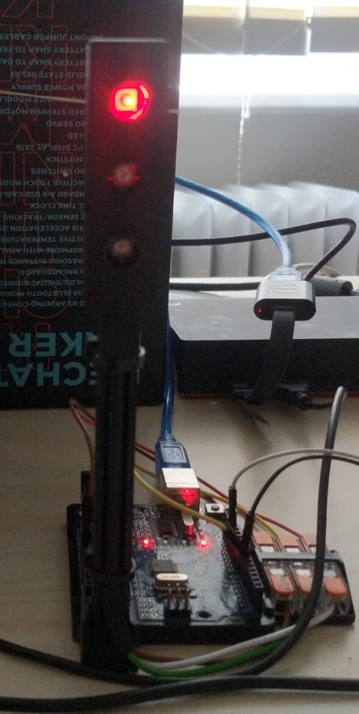

<!--

author:   Sebastian Zug & André Dietrich & Gero Licht
email:    sebastian.zug@informatik.tu-freiberg.de & andre.dietrich@informatik.tu-freiberg.de & gero.licht@informatik.tu-freiberg.de
version:  1.0.2
language: de
narrator: Deutsch Female

import: https://raw.githubusercontent.com/liascript-templates/plantUML/master/README.md
        https://raw.githubusercontent.com/LiaScript/CodeRunner/master/README.md

comment:  Erfassung der Ampel und der Hindernisse

-->

[](https://liascript.github.io/course/?https://raw.githubusercontent.com/TUBAF-IfI-LiaScript/VL_Robotik/main/04_SensorProcessing/04_Praktikum.md)

# Sensordatenvorverarbeitung

__... insbesondere für Laserscanner und Kameras.__

```ascii

       +----------+        +----------+                                
     +-+--------+ |     +--+--------+ |     +----------+     +----------+
+--> |Sensorik  +-+ --> | Filterung +-+ --> | Regelung | --> | Aktorik  | ---+
|    +----------+       +-----------+       +----------+     +----------+    |
|                                                                            |
|                              .---------------------.                       |
+----------------------------- | Umgebung            | <---------------------+
                               .---------------------.                                                              .
```

## Laserscanner

> Laserscanner generieren Fehler!

1. Reflexionsfehler

    Oberflächenreflexion: Oberflächen, die stark reflektieren oder zu wenig reflektieren (z. B. Glas, Wasser oder sehr dunkle Oberflächen), können die Messungen verzerren oder sogar verhindern.
    Mehrfachreflexionen: Wenn der Laserstrahl von mehreren Oberflächen reflektiert wird, kann der Laserscanner falsche Entfernungen messen.

2. Rauschen und Unsicherheit

    Signalrauschen: Bei großen Entfernungen oder schlechten Lichtverhältnissen kann das Signal des Lasers gestört werden, was zu verrauschten oder unscharfen Messergebnissen führt.
    Umgebungslicht: Starke Sonneneinstrahlung oder andere Lichtquellen können das Lasersignal beeinflussen und zu fehlerhaften Messwerten führen.

3. Bewegungsfehler

    Scannerbewegung: Wenn der Scanner während der Messung bewegt wird oder vibriert, kann dies die Messung verzerren.
    Bewegung des Objekts: Auch wenn das zu messende Objekt sich während des Scannens bewegt, kann dies zu unscharfen oder fehlerhaften Daten führen.

4. Winkel- und Geometriefehler

    Nicht optimale Ausrichtung: Wenn der Laserstrahl nicht im idealen Winkel auf eine Oberfläche trifft, kann dies die Genauigkeit der Messung beeinflussen.
    Beugung: Der Laserstrahl kann an Kanten oder scharfen Winkeln gebeugt werden, was zu Abweichungen in den Messergebnissen führt.

5. Kalibrierungsfehler

    Ungenaue Kalibrierung: Laserscanner müssen präzise kalibriert werden. Wenn die Kalibrierung fehlerhaft ist, kann dies systematische Abweichungen in den Messungen verursachen.

6. Atmosphärische Störungen

    Luftdruck, Temperatur und Feuchtigkeit: Diese Faktoren beeinflussen die Ausbreitung des Lasersignals und können zu kleinen, aber messbaren Abweichungen führen.

7. Totzone

    Nahe Objekte: Viele Laserscanner haben eine Mindestentfernung, unterhalb derer sie nicht genau messen können. Dies wird als Totzone bezeichnet.

8. Mehrdeutigkeit bei Mehrfachreflexionen

    In komplexen Umgebungen mit mehreren Objekten oder Oberflächen können Laserstrahlen mehrfach reflektiert werden, was zu fehlerhaften Abstandsmessungen führt, da der Scanner nicht mehr eindeutig zuordnen kann, von welcher Oberfläche das Signal zurückkam.

### Beispiel Shawdow-Punkte

```
ros2 run urg_node urg_node_driver --ros-args --params-file hokuyo_config.yml
```

Bringen Sie ein Objekt in den Messbereich des Laserscanners und beobachten Sie

- die Punkte im Kantenbereich
- das allgemeine Rauschen

> Versuchen Sie die Größenordnungen der Fehler zu bestimmen. (10min)

### Lösungsansatz Filter

```python medfilt.py
# Generate a signal with some noise
import numpy as np
from scipy import signal
from matplotlib import pyplot as plt

np.random.seed(0)
t = np.linspace(0, 5, 100)
x = np.sin(t) + .1 * np.random.normal(size=100)

plt.figure(figsize=(7, 4))
plt.plot(x, label='Original signal')
filtered = signal.medfilt(x)  # Apply a median filter
plt.plot(filtered, label='medfilt: median filter')

plt.legend(loc='best')
#plt.show()  
plt.savefig('foo.png') # notwendig für die Ausgabe in LiaScript
```
@LIA.eval(`["main.py"]`, `none`, `python3 main.py`)

> Vergrößern Sie das Fenster des Medianfilters und beobachten Sie die Auswirkungen auf das Rauschen. (5min)

### LaserFilter Paket in ROS2

> Die ROS2-Community hat bereits einige Filter implementiert, die Sie verwenden können. Deren Dokumentation steckt aber noch im Übergang von ROS1 nach ROS2.


```yaml 
scan_to_scan_filter_chain:
  ros__parameters:
    filter1:
      type: laser_filters/LaserScanSpeckleFilter
      name: speckle_filter
      params:
        filter_type: 0
        max_range: 2.0
        max_range_difference: 0.1
        filter_window: 2
    filter2:
       ...
```

## Kamera 

 

> Wie wollen wir den Status der Kamera erkennen? Welche Störfaktoren gibt es?


         {{1-2}}
********************************

* Lösungsansatz 1: Erkennung einzelner Laserscannerdaten

* Lösungsansatz 2: Erkennung der ganzen Ampel

********************************

### Lösungsansatz im HSV Farbraum

Der HSV Farbraum ist ein Farbmodell, das die menschliche Wahrnehmung von Farben besser repräsentiert als das RGB Farbmodell. Er besteht aus drei Komponenten:

- H: Hue (Farbton)
- S: Saturation (Sättigung)
- V: Value (Helligkeit)

 by (3ucky(3all; then transfered to Commons by Moongateclimber., CC BY-SA 3.0, https://commons.wikimedia.org/w/index.php?curid=943857")<!-- style="width: 50%;"-->

```python
import cv2
import numpy as np
import time

# Open the video stream
cap = cv2.VideoCapture(4)

while True:
    ret, frame = cap.read()
    # Convert the frame to HSV
    hsv = cv2.cvtColor(frame, cv2.COLOR_BGR2HSV)

    # Define the range of red color in HSV
    lower_red = np.array([0, 50, 50])
    upper_red = np.array([10, 255, 255])

    # Threshold the HSV image to get only red colors
    mask = cv2.inRange(hsv, lower_red, upper_red)
    # Bitwise-AND mask and original image
    res = cv2.bitwise_and(frame, frame, mask=mask)

    # Display the frame
    cv2.imshow('frame', frame)
    cv2.imshow('mask', mask)
    cv2.imshow('res', res)
    # Break the loop if 'q' is pressed
    if cv2.waitKey(1) & 0xFF == ord('q'):
        break
```

## Aufgaben: 

Integrieren Sie die Startampel in Ihren Roboter. Dieser startet erst mit der Linienverfolgung, wenn die Ampel auf Grün springt.
