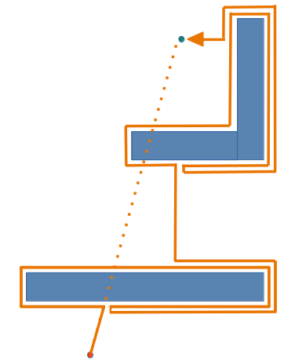
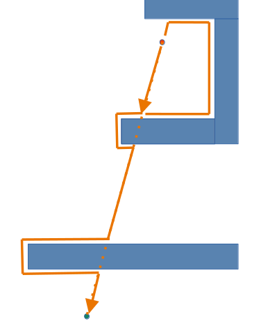
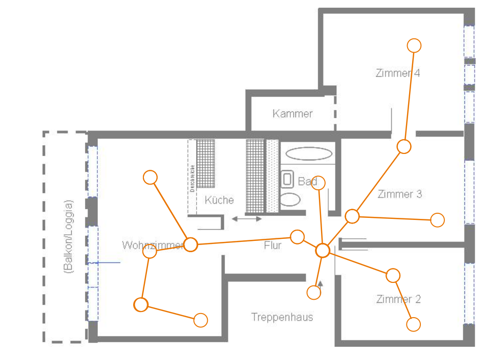

<!--

author:   Sebastian Zug & André Dietrich & Gero Licht
email:    sebastian.zug@informatik.tu-freiberg.de & andre.dietrich@informatik.tu-freiberg.de & gero.licht@informatik.tu-freiberg.de
version:  1.0.6
language: de
narrator: Deutsch Female

comment:  Beschreibung der Schritte für die Umsetzung einer Navigation mobiler Roboter

import:   https://raw.githubusercontent.com/TUBAF-IfI-LiaScript/VL_Robotik/main/config.md
          https://github.com/liascript/CodeRunner

-->

[](https://liascript.github.io/course/?https://raw.githubusercontent.com/TUBAF-IfI-LiaScript/VL_Robotik/main/05_FromScanToPlan/05_Vorlesung.md)


# Vom Scan zum Plan

<!-- data-type="none" -->
| Parameter                | Kursinformationen                                                                                |
| ------------------------ | ------------------------------------------------------------------------------------------------ |
| **Veranstaltung:**       | @config.lecture                                                                                  |
| **Semester**             | @config.semester                                                                                 |
| **Hochschule:**          | `Nordakademie - Hochschule der Wirtschaft`                                                       |
| **Inhalte:**             | `Kartenerzeugung und Pfadplanung`                                                                |
| **Link auf Repository:** | [https://github.com/TUBAF-IfI-LiaScript/VL_Robotik/blob/main/05_FromScanToPlan/05_Vorlesung.md |
| **Autoren**              | @author                                                                                          |


---------------------------------------------------------------------

**Fragen an die heutige Veranstaltung ...**

* Wie unterschieden sich reaktive und kartenbasierte Navigation?
* Welche Herausforderungen ergeben sich bei der Umsetzung von Bug-Algorithmen?
* Wie können Transformationen von Koordinatensystemen realisiert werden?
* Welche Bedeutung haben homogene Koordinaten?
* Wie können Transformationen in ROS realisiert werden?

---------------------------------------------------------------------

## Hinweise zum weiteren Vorgehen 

Übersicht zu den Bewertungskriterien:

https://github.com/TUBAF-IfI-LiaScript/VL_Robotik/blob/main/Bewertung.md

CI/CD Implementierung für GitHub Actions 

https://github.com/marketplace/actions/ros-2-ci

## Einordnung

```ascii
                    Statusmeldungen 
     Nutzereingaben  ^                                       
                 |   |
Befehle          v   |
            +-----------------------+
            | Handlungsplanung      |  "$Strategie   $"
            +-----------------------+
                 |   ^     | | |        Folge von Aktionen     
                 v   |     v v v
            +-----------------------+
            | Ausführung            |  "$Taktik$    "           
            +-----------------------+
                     ^      | | |       Geplante Trajektorie,
Status               |      v v v       Verhalten
            +-----------------------+
            | Reaktive Überwachung  |  "$Ausführung$        "
            +-----------------------+
Sensordaten-    ^ ^ ^        | | |      Steuerbefehle an den 
erfassung       | | |        v v v      Aktuator 
            +----------+ +----------+
            | Sensoren | | Aktoren  |                               
            +----------+ +----------+
                  ^           |
                  |           v      
            .-----------------------.
            | Umgebung              |
            .-----------------------.                                                                                .
```

## Ausgangspunkt Reaktive Navigation

                              {{0-1}}
***********************************************************************

> Sofern keine Karte genutzt wird, erfolgt die Navigation allein anhand reaktiver Verhaltensweisen. 

> __Aufgabe:__ Recherchieren Sie die verschiedenen Varianten der Braitenberg Vehicles und erklären Sie warum wir diese auf der Reaktiven Ebene einordnen.


***********************************************************************

                              {{1-2}}
***********************************************************************

!?[](https://www.youtube.com/watch?v=9WvTXxPwaY0)


***********************************************************************

### Bug Algorithmen

                              {{0-1}}
***********************************************************************

Die Bug_X Algorithmen basieren auf 2 Grundannahmen:

+ die Richtung zum Ziel ist bekannt
+ der Roboter ist in der Lage Hindernissen zu folgen

-----------------------------


<div>
 Algorithmus
 <ul>
  <li>Folge der Linie die Start und Ziel verbindet</li>
  <li>wenn ein Hindernis im Weg ist, folgen dessen Außenkontur, bis Du Dich in Richtung des Ziels ausrichten kannst - dann verlasse die Konturlinie und bewege dich Richtung Ziel </li>
</ul> 
</div>

> Unter welchen Bedingungen scheitert der Ansatz?

***********************************************************************

                              {{1-2}}
***********************************************************************

> Wir brauchen ein Gedächtnis!


<div>
Algorithmus
 <ul>
  <li>Folge der Linie die Start und Ziel verbindet</li>
  <li>wenn ein Hindernis im Weg ist, umrunde es bist die  - dann verlasse die Konturline und bewege dich Richtung Ziel </li>
</ul> 
</div>

Die kürzeste Trajektorie wird durch die Länge $D$ der unmittelbaren Verbindungslinie beschrieben, die obere Schranke ergibt sich durch die Konturen $K_i$ der Hindernisse. Diese werden im schlimmsten Fall $1.5x$ umrundet. 

***********************************************************************

                              {{2-3}}
***********************************************************************


<div>
Algorithmus
 <ul>
  <li>Folge der Linie die Start und Ziel verbindet</li>
  <li>wenn ein Hindernis im Weg ist, folge der Kontur bis zur ursprünglichen Verbindungslinie, sofern dieser Schnittpunkt dichter am Ziel liegt verlasse die Konturline und bewege dich Richtung Ziel 
 </li>
</ul> 
</div>

Was passiert mit einer komplexeren Kontur - im folgenden drehen wir die Richtung der Bewegung um.




***********************************************************************

                              {{3-4}}
***********************************************************************

> Weitere Herausforderungen ...

+ Für welche Richtung entscheiden wir uns bei der Umrundung des Hindernisses?
+ Wann verlassen wir die Objektkontur?


***********************************************************************

## Kartentypen für die Umgebungsrepräsentation

Welche Kartenformate müssen wir unterscheiden?

__1. Zellbasierte Ansätze__

Eine Rasterkarte bildet die Umgebung auf Formen (Kacheln/Tiles) ab. Übliche Formate dafür sind quadratisch, dreieckig und sechseckig, wobei erstgenannte als einheitliche unterteilte regelmäßige Gitter/Grids in der ROS-Standardimplementierung Verwendung finden. 


_Darstellung einer (simulierten) Umgebung in Form eines regelmäßigen Grids (Autor [lukovicaleksa](https://github.com/lukovicaleksa/grid-mapping-in-ROS))_

> Die Griddarstellung umfasst die Information zur Besetztheit der Zelle.

Quadtrees erlauben eine adaptive Konfiguration der Auflösung in zentralen Bereichen


> Verwendung im Robotik-Kontext siehe [Elfes 1989](https://www.cs.cmu.edu/~motionplanning/papers/sbp_papers/integrated4/elfes_occup_grids.pdf).

__2. Topologische Ansätze__

Graphenrepräsentationen fokussieren sich auf die Abstände zwischen ausgewählte Landmarken und bilden die potentiellen Bewegungspfade auf die Kanten dazwischen ab. 



## Und wie entsteht die Karte?

Wir schauen uns dazu nochmals das Format einer Laserscan-Nachricht an:

```
std_msgs/msg/Header header
float angle_min
float angle_max
float angle_increment
float time_increment
float scan_time
float range_min
float range_max
float[] ranges
float[] intensities
```

```
builtin_interfaces/msg/Time stamp
string frame_id
```

Wo spielen die Metainformationen zur `frame_id` einen Rolle? Wenn Daten unterschiedlicher Herkunft aufeinander abgebildet werden müssen. 

> Beispiel 1: Zwei Roboter operieren in einem Areal. Einer erkennt ein kritisches Hindernis - wo befindet es sich in Bezug auf den anderen Roboter?

> Beispiel 2: Ein stationärer Manipulator erfasst alle Objekte auf der Arbeitsfläche in dem er eine Kamera über diese bewegt. Entsprechend werden alle Objekte im Koordinatensystem der Kamera beschrieben. Für die Planung der Greifoperation müssen wir deren Lage aber auf das Basiskoordinatensystem des Roboters überführen.

<!-- style="width: 70%;"-->

### Mathematische Beschreibung 

Entsprechend beziehen sich Punkte als Vekoren $\textbf{p}=[x, y]$ im Raum immer auf ein Bezugskoordinatensystem $A$, dass bei deren Spezifikation als Index angegeben wird $\textbf{p}_A$.

<!-- style="width: 50%;"-->

#### Relevante Transformationen

Aus dem Kontext der _körpererhaltende Transformationen_ (im Unterschied zu Scherung und Skalierung) müsen zwei Relationen berücksichtigt werden:

1. Translation 

Die Darstellung eines Punkte im Koordinatensystem $A$ kann mit dem Translationsvektor $t_{A\rightarrow B}$ bestimmt werden.

$$
\begin{align*} 
\textbf{p}_A - \textbf{p}_B &= \textbf{t}_{A\rightarrow B} \\
\textbf{p}_B &= \textbf{p}_A - \textbf{t}_{A\rightarrow B} 
\end{align*} 
$$

<!-- style="width: 50%;"-->

2. Rotation

    Bisher haben wir lediglich Konzepte der translatorischen Transformation betrachtet. Rotationen um den Winkel $\varphi$ lassen sich folgendermaßen abbilden.

    <!-- style="width: 20%;"-->

    $$ x_B = x_A\cos\varphi + y_A\sin\varphi,$$
    $$ y_B= -x_A\sin\varphi + y_A\cos\varphi,$$

     und $y_A\sin\varphi$ (rot)")

    In der Matrizenschreibweise bedeutet dies

$$
\textbf{p}_B 
=
\begin{bmatrix}
\cos\varphi & \sin\varphi \\ 
-\sin\varphi & \cos\varphi
\end{bmatrix}_{A\rightarrow B}
\cdot
\textbf{p}_B \\
$$

#### Homogene Koordinaten

<!-- style="width: 35%;"-->

Fassen wir nun Translation und Rotation zusammen, so können wir eine 2D Koordinatentransformation mit 

$$\textbf{p}_B=\begin{bmatrix}
\cos\varphi & \sin\varphi \\ 
-\sin\varphi & \cos\varphi
\end{bmatrix}_{A\rightarrow B} \cdot \textbf{p}_A - \textbf{t}_{A\rightarrow B}$$

beschreiben. Problematisch ist, dass 

+ die Translation auf einer Addition und 
+ die Rotation auf der Multiplikation von Matrizen 

beruhen. 

Homogene Koordinaten lösen dieses Problem durch das Hinzufügen einer weiteren, virtuellen Koordinate. Der Wert der Matrix bleibt dabei unverändert!

1. Translation 

$$
\begin{align*} 
\begin{bmatrix}
\textbf{p}_B \\
1 \\
\end{bmatrix}
&=
\underbrace{
\begin{bmatrix}
1 & 0 & -t_x\\ 
0 & 1 & -t_y \\
0 & 0 & 1 \\
\end{bmatrix}}_{\textbf{T}_{A\rightarrow B}}
\cdot
\begin{bmatrix}
\textbf{p}_A \\
1 \\
\end{bmatrix}_A \\ 
\end{align*}
$$

2. Rotation 

$$
\begin{align*} 
\begin{bmatrix}
\textbf{p}_B \\
1 \\
\end{bmatrix}
&=
\underbrace{
\begin{bmatrix}
\cos\varphi & \sin\varphi & 0\\ 
-\sin\varphi & \cos\varphi & 0 \\
0 & 0 & 1 \\
\end{bmatrix}}_{\textbf{R}_{A\rightarrow B}}
\cdot
\begin{bmatrix}
\textbf{p}_A \\
1 \\
\end{bmatrix}_A \\ 
\end{align*}
$$

> Beide Transformationsarten sind mit einer mathematischen Operation erklärt. Damit lassen sich auch die Rechenregeln für Matrizen anwenden.

#### Inverse Transformation

Die Umkehrung einer Transformation wird über die inverse Matrix von $R$ und $T$ abgebildet. Dabei bieten die spezfischen Eigenschaften der Matrix Vereinfachungsmöglichkeiten.

1. Translation 

Die Umkehrung der Translation mit $\textbf{t}_{A\rightarrow B}$ kann über einen entgegengesetzte Verschiebung anhand von $\textbf{t}_{B\rightarrow A}$ realisiert werden. In homogenen Koordinaten bedeutet das:

$$
\begin{align*}
\begin{bmatrix}
\textbf{p}_B \\
1 \\
\end{bmatrix} 
&= 
T_{A\rightarrow B} \cdot
\begin{bmatrix}
\textbf{p}_A \\
1 \\
\end{bmatrix} \\
\begin{bmatrix}
\textbf{p}_A \\
1 \\
\end{bmatrix} 
&= 
T_{A\rightarrow B}^{-1} \cdot
\begin{bmatrix}
\textbf{p}_B \\
1 \\
\end{bmatrix} 
= 
T_{B\rightarrow A} \cdot
\begin{bmatrix}
\textbf{p}_B \\
1 \\
\end{bmatrix} 
\end{align*}
$$

$$
T_{A\rightarrow B} \cdot T_{A\rightarrow B}^{-1} = 
\begin{bmatrix}
1 & 0 & -t_x\\ 
0 & 1 & -t_y \\
0 & 0 & 1 \\
\end{bmatrix}
\cdot
\begin{bmatrix}
1 & 0 & t_x\\ 
0 & 1 & t_y \\
0 & 0 & 1 \\
\end{bmatrix} 
= 
E
$$
10_Koordinatentransformation
\textbf{p}_B \\
1 \\
\end{bmatrix} 
&= 
R_{A\rightarrow B} \cdot
\begin{bmatrix}
\textbf{p}_A \\
1 \\
\end{bmatrix} \\
\begin{bmatrix}
\textbf{p}_A \\
1 \\
\end{bmatrix} 
&= 
R_{A\rightarrow B}^{-1} \cdot
\begin{bmatrix}
\textbf{p}_B \\
1 \\
\end{bmatrix} 
= 
R_{B\rightarrow A} \cdot
\begin{bmatrix}
\textbf{p}_B \\
1 \\
\end{bmatrix} 
\end{align*}
$$


$$
R_{A\rightarrow B} \cdot R_{A\rightarrow B}^{-1} = 
\begin{bmatrix}
\cos\varphi & \sin\varphi & 0\\ 
-\sin\varphi & \cos\varphi & 0 \\
0 & 0 & 1 \\
\end{bmatrix}
\cdot
\begin{bmatrix}
\cos\varphi & -\sin\varphi & 0\\ 
\sin\varphi & \cos\varphi & 0 \\
0 & 0 & 1 \\
\end{bmatrix} 
= 
E
$$

> Die Berechnung einer inversen Matrix ist nicht nötig. 

#### Kombination von Transformationen

Sofern sich in dieser Kette weitere Koordinatensysteme wiederfinden können weitere Transformationsmatrizen $T_{M\rightarrow N}$ oder $R_{M\rightarrow N}$ integriert werden. Dabei sind sich wiederholende Verschiebungen oder Rotationen als Aggregation zu betrachten.

$$\textbf{p}_D=\underbrace{\bm{T}_{A\rightarrow B} \bm{T}_{B\rightarrow C} \bm{T}_{C\rightarrow D}}_{\substack{\bm{T}_{A\rightarrow D}}} \cdot \textbf{p}_A$$

$$\textbf{p}_D=\underbrace{\bm{R}_{A\rightarrow B} \bm{R}_{B\rightarrow C} \bm{R}_{C\rightarrow D}}_{\substack{\bm{R}_{A\rightarrow D}}} \cdot \textbf{p}_A$$

Bedeutsamer ist die Kombination aus beiden Typen - dabei gilt die Aussage $T \cdot R = R \cdot T$ nicht!

$$
\begin{bmatrix}
\textbf{p}_B \\
1 \\
\end{bmatrix} 
= 
R_{A\rightarrow B} \cdot T_{A\rightarrow B} 
\cdot
\begin{bmatrix}
\textbf{p}_A \\
1 \\
\end{bmatrix} 
= 
\begin{bmatrix}
\cos\varphi & \sin\varphi & -t_x\\ 
-\sin\varphi & \cos\varphi & -t_y \\
0 & 0 & 1 \\
\end{bmatrix}
\cdot 
\begin{bmatrix}
\textbf{p}_A \\
1 \\
\end{bmatrix} 
$$


### Beispiel Anwendungsfall 2D

Die folgende Grafik stellt zwei Koordinatensysteme ($A$, $B$) dar. Diese sind in einem globalen Koordinatensystem $O$ angeordnet. Die Translation zwisch $O$ und $A$ sowie $B$ wird durch den Vektor $t_A$ und $t_B$ illustriert.

Die Werte für $t_{A_x}$, $t_{A_y}$ und $\varphi_A$ können über die Schieberegler am linken oberen Rand verändert werden.

Der grüne Vektor markiert die gesuchte Größe - die Abbildung des Hindernisses, dass in $A$ am Punkt (2,3) liegt. Durch die Veränderung der Lage von A in O kann dieser Wert aus globaler Sicht verändert werden (vgl. $F_O$). 

??[asf](https://www.geogebra.org/classic/htug5qmn?embed)

Die nachfolgende Berechnung zeigt, wie die zuvor gezeigten Koordinatentransformationen für die Abbildung des Punktes F genutzt werden können.

```python    coordinates.py
import numpy as np
from numpy.linalg import inv
 
phi_A = 0 * np.pi /180      # phi in Radiant
t_A = [2, 0.5]
p_A = [2, 3]             # Angabe in homogenen Koordinaten
R_OB = np.array([[ np.cos(phi_A), -np.sin(phi_A),     0],
                 [ np.sin(phi_A), np.cos(phi_A),      0],
                 [             0,            0 ,     1]])
T_OB = np.array([[            1,             0,  t_A[0]],
                 [             0,            1,  t_A[1]],
                 [             0,            0,      1]])

# Determine transformation matrix
Xi_OB = np.dot(T_OB, R_OB)

# Determine f_global
p_O= Xi_OB.dot(np.append(p_A, 1))
print(p_O[0:2])
```
@LIA.eval(`["main.py"]`, `none`, `python3 main.py`)

> Aufgabe: Berechnen Sie die die Koordinatenangabe im System $B$

### 3D Koordinaten

<!--  style="width:50%; max-width:300px; min-width:600px"-->

> Merke: _The Axes display shows a set of axes, located at the origin of the target frame - __red - x green - y blue -z__

Die entsprechende translatorische Transformation in homogenen Koordinaten ergibt sich nun mit einer erweiterten Matrix:

$$
T_{A\rightarrow B}
= 
\begin{bmatrix}
1 & 0 & 0 & -t_x\\ 
0 & 1 & 0 & -t_y \\
0 & 0 & 1 & -t_z\\
0 & 0 & 0 & 1\\
\end{bmatrix}
$$

> Wie ist es um die Rotationen bestellt? 

Nunmehr müssen wir drei Rotationsachsen betrachten.

| Bezeichnung | Achse | Transformationsmatrix |
|------------|--------|---------------|
| Gieren (Hochachse) | z      | $ R^z_{A\rightarrow B} =  \begin{bmatrix} \cos\varphi & \sin\varphi & 0 & 0\\  -\sin\varphi & \cos\varphi & 0 & 0\\ 0 & 0 & 1 & 0\\  0 & 0 & 0 & 1 \\ \end{bmatrix} $ |
| Nicken (Querachse)    | y      | $ R^y_{A\rightarrow B} =  \begin{bmatrix} \cos\varphi &  0 & \sin\varphi & 0\\  0 & 1 & 0  & 0\\  -\sin\varphi &  0 & \cos\varphi & 0\\ 0 & 0 & 0 & 1 \\ \end{bmatrix} $ |
| Rollen (Längsachse)      | x      | $ R^x_{A\rightarrow B} =  \begin{bmatrix} 1 & 0 & 0 & 0\\ 0 & \cos\varphi & \sin\varphi & 0 \\ 0 & -\sin\varphi & \cos\varphi & 0 \\ 0 & 0 & 0 & 1 \\ \end{bmatrix} $ |

Positiv:

+ Intuitiv benutzbar
+ Gut geeignet für die Bewegung in Animationen - die virtuelle Kamer lässt sich gut durch die Eulerwinkel interpolieren!

Negativ: 

− Gimbal Lock (Unstetigkeit)

− Für allgemeine Rotationen bestimmen sich die Eulerwinkel nicht eindeutig

> ROS nutzt für die Darstellung von Rotationen Quaternionen. Diese überwinden die Einschränkungen der Euler-Winkel Darstellung sind aber nicht so anschaulich. Entsprechend stellt die TF Bibliothek Transformationsvorschriften bereit, um zwischen beiden Formaten zu wechseln.

!?[Tutorial](https://www.youtube.com/watch?v=_t4HZ8r_qFM) 

### Umsetzung in ROS

Die Handhabung der unterschiedlichen Koordinatensystem in ROS ist über das `tf`-verteitle System gelöst.

)")

ROS stellt unter dem namen _tf2_ mehrere Pakete bereit, um Transformationen zu handhaben. Um die Abbildung von Daten aus einem Koordinatensystem in ein anderes zu realisieren müssen diese in einer Baumstruktur verbunden sein. Ausgehend davon können wir eine Information aus einem _Frame_ (Knoten im Baum) in einen anderen überführen.

+ eindeutige Zuordnung zu Frames 
+ mathematische Darstellung der Translations-/Rotationsparameter
+ ggf. Kommunikation von Änderungen der Translation-/Rotationsparameter


Grundlage dieser Lösung ist die Integration einer Frame-ID in jeden Datensatz. Jede `sensor_msgs` enthält entsprechend einen header, der folgendermaßen strukturiert ist.

```text  std_msgs/Header Message
# sequence ID: consecutively increasing ID
uint32 seq
#Two-integer timestamp that is expressed as:
# * stamp.sec: seconds (stamp_secs) since epoch (in Python the variable is called 'secs')
# * stamp.nsec: nanoseconds since stamp_secs (in Python the variable is called 'nsecs')
time stamp
#Frame this data is associated with
string frame_id
```

Eine Transformation kann entweder 

+ statisch (ändert sich nicht im Laufe der Zeit) oder 
+ dynamisch (kann sich im Laufe der Zeit ändern, muss es aber nicht) 

sein. Die Unterscheidung ist aus Fehlertoleranzgründen wichtig, robuste Systeme müssen wissen, ob ihre Informationen ggf. veraltet sind. Statische Transformationen können einmal gesendet werden und können dann als bekannt vorausgesetzt werden.

### Beispiel - Laserscan

```bash    RunLaserScanner
ros2 run urg_node urg_node_driver --ros-args 
      --params-file ./examples/07_ROS_Pakete/startupHokuyo/config/hokuyo_config.yml
```

```bash 
urg_node:
  ros__parameters:
    serial_port: "/dev/ttyACM0"
    serial_baud: 115200
    laser_frame_id: laser
    scan_time: 0.1
    range_min: 0.02
    range_max: 5.0
    publish_intensity: false
    publish_multiecho: false
```

```bash  StartTransformPublisher
# deprecated version
# ros2 run tf2_ros static_transform_publisher 1 0 0 0 0 0 laser world
ros2 run tf2_ros static_transform_publisher --x 1 --y 0 --z 0 
                                            --yaw 0 --pitch 0 --roll 0 
                                            --frame-id laser --child-frame-id world     
[INFO] [1706605092.505727237] [static_transform_publisher_Bb8HJhELdkMTNFcb]: Spinning until stopped - publishing transform
translation: ('1.000000', '0.000000', '0.000000')
rotation: ('0.000000', '0.000000', '0.000000', '1.000000')
from 'laser' to 'world'
```


### Und nun?

> Jetzt müssen wir die einzelnen Sensordaten zusammenführen, um eine Karte zu erstellen. Wir konzentrieren uns dazu auf die Laserscannerdaten und den ICP Algorithmus.

[]](https://upload.wikimedia.org/wikipedia/commons/thumb/c/c0/Idea_closest_point_algorithm.svg/1280px-Idea_closest_point_algorithm.svg.png "Von Biggerj1 - Eigenes Werk, CC BY-SA 4.0, https://commons.wikimedia.org/w/index.php?curid=88265436")

1. Für jeden Punkt (aus der gesamten Menge von Eckpunkten, die normalerweise als dicht bezeichnet wird, oder eine Auswahl von Punktpaaren aus jedem Modell) in der Quellpunktwolke wird der nächste Punkt in der Referenzpunktwolke (oder einer ausgewählten Menge) zugeordnet.
2. Schätze die Kombination aus Rotation und Translation unter Verwendung einer Minimierungstechnik zwischen den Punkten, die die beste Ausrichtung jedes Quellpunkts mit seinem in Schritt 1 gefundenen Gegenstück ermöglicht. Dieser Schritt kann auch die Gewichtung von Punkten und das Ablehnen von Ausreißern vor der Ausrichtung beinhalten.
3. Transformiere die Quellpunkte mit der ermittelten Transformation.
4. Wiederhole den Vorgang (erneute Zuordnung der Punkte usw.).

> Welche Probleme vermuten Sie?

!?[](https://www.youtube.com/watch?v=QWDM4cFdKrE)

## Zielstellungen kartenbasierte Pfadplanung  

Das Pfadplanungsproblem lässt sich als Algorithmus verstehen der als Input 

+ die Start Pose (Position + Orientierung)
+ die Ziel Pose 
+ eine geometrische Beschreibung des Roboters 
+ die Repräsentation der Umgebung 

erhält, um daraus eine Folge von Posen ohne Kollisionen mit den Elementen der Umgebung zu erzeugen.

> Vor dem Hintergrund mehrerer gültiger Trajektorien soll ein optimaler Pfad mit minimalen Aufwand erzeugt werden.

Optimalitätskriterien der Trajektorie:

- kürzester Pfad 
- Pfad mit geringster Unsicherheit (geringe Zahl von Richtungsänderungen)
- Erfassbarkeit dynamischer Objekte
- ... 

Performance des Algorithmus 

- Vollständligkeit 
- Optimalität 
- Zeitkomplexität
- Komplexität des Suchraumes

> Es existiert eine Vielzahl von Algorithmen, die sich in ihrer Komplexität und Anwendungsbereichen unterscheiden. Einen guten Überblick dazu bietet die Open Motion Planning Library (OMPL).

### Beispiel 1 Breadth-first search (Wavefront)

```
initialize:
  graph := {nodes}, {edges}
  fringe := {root}
  visited := empty

breadth-first-search (graph, fringe, visited):
  while fringe not empty
     node := first element of fringe
     // goal reached
     if node is what we are searching for
        return success
     endif
     // continue wavefront 
     children := find children of node in graph
     add children not in visited to back of fringe
     add node to visited
     remove node from fringe
  end while
  return failure
```


```
Ausgangspunkt              Schritt 1                  Schritt 2 
S 0 0 0 0 0 0 0 0 0 0 0    S 0 0 0 0 0 0 0 0 0 0 0    S 0 0 0 0 0 0 0 0 0 0 0
0 0 0 0 0 0 0 0 0 0 0 0    0 0 0 0 0 0 0 0 0 0 0 0    0 0 0 0 0 0 0 0 0 0 0 0
0 0 0 1 1 1 1 1 1 0 0 0    0 0 0 1 1 1 1 1 1 0 0 0    0 0 0 1 1 1 1 1 1 0 0 0
0 0 0 1 1 1 1 1 1 0 0 0    0 0 0 1 1 1 1 1 1 0 0 0    0 0 0 1 1 1 1 1 1 4 4 4   ...
0 0 0 0 0 0 0 0 0 0 0 0    0 0 0 0 0 0 0 0 0 0 3 3    0 0 0 0 0 0 0 0 0 4 3 3
0 0 0 0 0 0 0 0 0 0 0 G    0 0 0 0 0 0 0 0 0 0 3 2    0 0 0 0 0 0 0 0 0 4 3 2
```

Die "Welle" breitet sich mit jedem weiteren Schritt auf die Kinder aus, denen noch kein >1 zugewiesen wurde. Zum Zeitschritt 13 sind keine Zellen mehr zu explorieren. Zu diesem Zeitpunkt wird den unerreichbaren Teilen des Raums (falls vorhanden) der Wert 0 zugewiesen. Der Beispielraum sieht wie folgt aus:

```
 14 13 12 11 10  9  8  7  7  7  7  7
 13 13 12 11 10  9  8  7  6  6  6  6
 13 12 12  1  1  1  1  1  1  5  5  5
 13 12 11  1  1  1  1  1  1  4  4  4
 13 12 11 10  9  8  7  6  5  4  3  3
 13 12 11 10  9  8  7  6  5  4  3  2
```

In diesem Diagramm hat die Startposition den Wert 14 und das Ziel den Wert 2. Um einen optimalen Pfad zu planen, beginnt man am Ziel und wählt an jedem Punkt, bis man das Ziel erreicht hat, die nächste Zelle, die den geringsten Wert aller benachbarten Zellen hat.

Beispiel: (0,5)->(1,5)->(2,5)->(3,5)->(4,5)->(5,5)->(6,5)->(7,4)->(8,4)->(9,3)->(9,2)->(10,1)->(11,0)

> Nach welchen Kriterien können wir einen Pfad auswählen?

> Im Unterschied zur Breitensuche kann auch eine Tiefensuche ausgeführt werden - der Vorteil ist, dass das Ziel ggf. schneller erreicht wird, die Performance steigt in diesem Fall.

### Beispiel 2 A*

Der A$*$-Algorithmus gehört zur Klasse der informierten Suchalgorithmen (im Unterschied zur zuvor beschriebenen Breitensuche). Er kann zur Berechnung eines kürzesten Pfades zwischen zwei Knoten in einem Graphen mit __positiven Kantengewichten__ genutzt werden. A* wurde erstmals von 1968 von Peter Hart, Nils J. Nilsson und Bertram Raphael beschrieben. 

Der Algorithmus gilt als Verallgemeinerung und Erweiterung des Dijkstra-Algorithmus, in vielen Fällen kann aber umgekehrt A* auch auf Dijkstra reduziert werden. 

)")

Der A*-Algorithmus untersucht immer die Knoten zuerst, die wahrscheinlich schnell zum Ziel führen. Um den vielversprechendsten Knoten zu ermitteln, wird allen bekannten Knoten $x$ jeweils durch eine Metrik ein Wert $f(x)$ zugeordnet, der eine Abschätzung angibt, wie lang der Pfad vom Start zum Ziel unter Verwendung des betrachteten Knotens im günstigsten Fall ist. Der Knoten mit dem niedrigsten $f$-Wert wird als nächster untersucht.

$$
f(x) = g(x) + h(x) 
$$

$h$ repräsentiert die Heuristik, die den noch verbliebenen Weganteil zum Ziel ausmacht. Dabei muss sichergestellt werden, dass $h(x)$ den tatsächlichen Wert überschätzt.

Zunächst werden die Knoten in 3 Klassen eingeteilt 

+ unbekannte Knoten: Diese Knoten wurden während der Suche noch nicht gefunden. Zu ihnen ist noch kein Weg bekannt. Jeder Knoten (außer dem Startknoten) ist zu Beginn des Algorithmus unbekannt.
+ bekannte Knoten: Zu diesen Knoten ist ein (möglicherweise suboptimaler) Weg bekannt. Alle bekannten Knoten werden zusammen mit ihrem f f-Wert in der sogenannten Open List gespeichert. Aus dieser Liste wird immer der vielversprechendste Knoten ausgewählt und untersucht. Die Implementierung der Open List hat großen Einfluss auf die Laufzeit und wird oft als einfache Prioritätswarteschlange (z. B. binärer Heap) realisiert. Zu Beginn ist nur der Startknoten bekannt.
+ abschließend untersuchte Knoten: Zu diesen Knoten ist der kürzeste Weg bekannt. Die abschließend untersuchten Knoten werden in der sogenannten Closed List gespeichert, damit sie nicht mehrfach untersucht werden. Um effizient entscheiden zu können, ob sich ein Element auf der Closed List befindet, wird diese oft als Menge implementiert. Die Closed List ist zu Beginn leer.

> Jeder bekannte oder abschließend besuchte Knoten enthält einen Zeiger auf seinen (bisher besten) Vorgängerknoten. Mit Hilfe dieser Zeiger kann der Pfad bis zum Startknoten rückverfolgt werden. 

!?[](https://www.youtube.com/watch?v=D_T7vwwd2T4)

## ROS2 - Navigation Stack


!?[](https://www.youtube.com/watch?v=QB7lOKp3ZDQ&t=9s)
